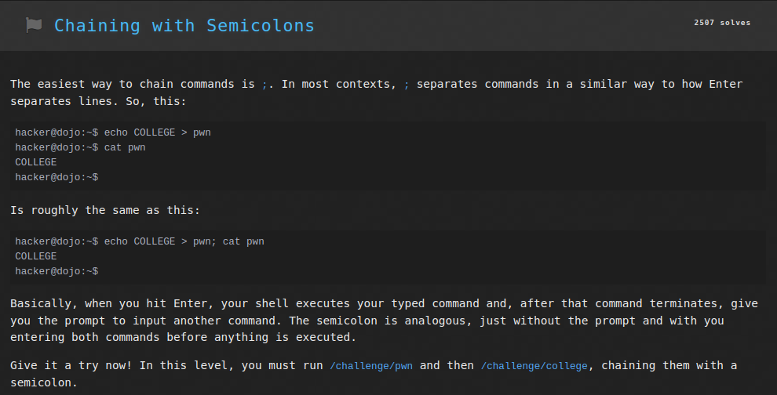
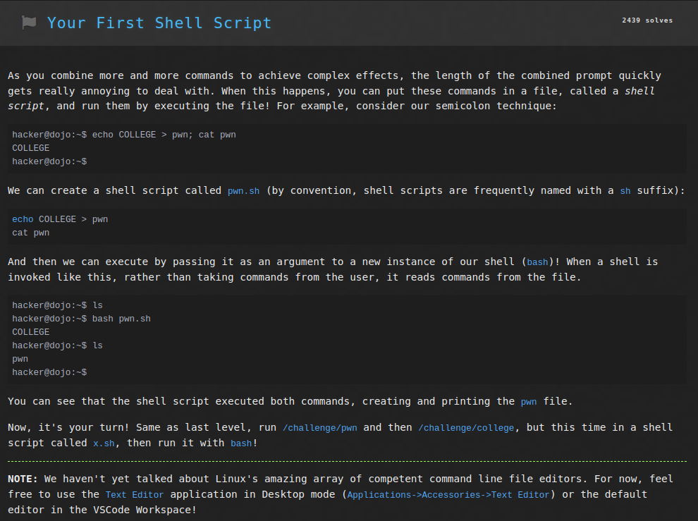
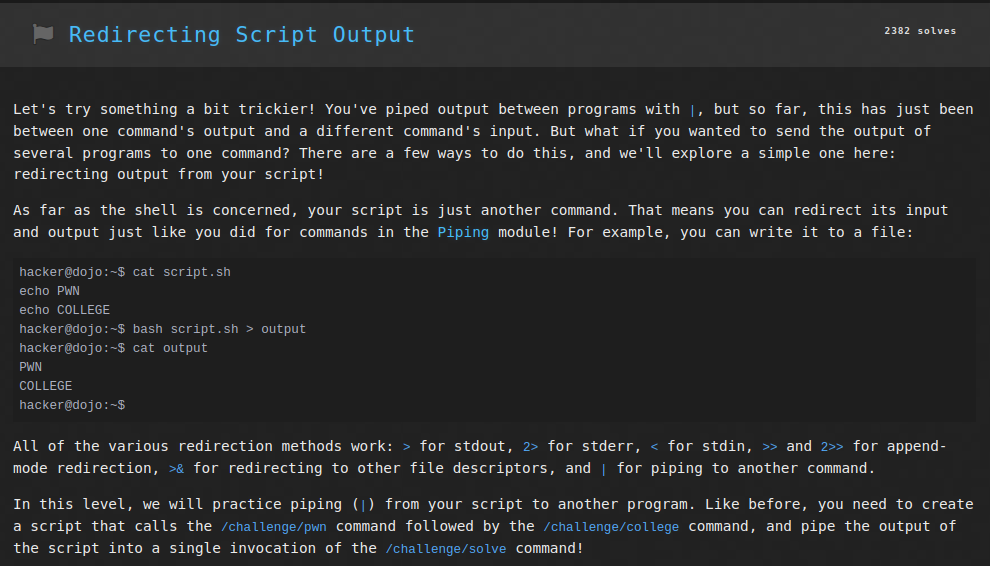
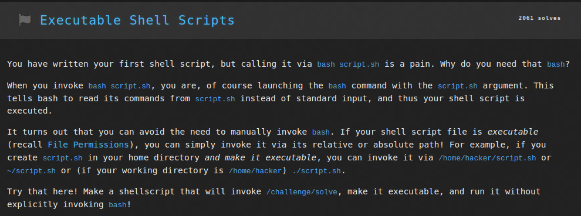

# Linux Luminarium: Chaining Commands

This write-up covers the solutions for the "Chaining Commands" module in pwn.college, detailing the thought process and step-by-step solution for each problem.

---

## Challenge 1: Chaining with Semicolons

### Problem Description
A challenge to get the flag by running the programs `/challenge/pwn` and `/challenge/college` chained with a semicolon.

### Approach
1. I connected to the SSH using the command `ssh -i key hacker@pwn.college`.
2. I entered the command `/challenge/pwn;/challenge/college` to run both commands in a single line, which displayed the flag.

### Flag
`pwn.college{0fCP74QWb4Yyz9NfRpxSFO32qY-.dVTN4QDLyITO0czW}`

## Challenge 2: Your First Shell Script

### Problem Description
A challenge to get the flag by running the programs `/challenge/pwn` and `/challenge/college` through a shell script `x.sh`.

### Approach
1. I connected to the SSH using the command `ssh -i key hacker@pwn.college`.
2. I entered the command `nano x.sh` to edit the file `x.sh` in the command line text editor.
3. Within the file `x.sh`, I wrote the commands `/challenge/pwn` and `/challenge/college` and saved the shell script using `CTRL+X`.
4. Now `bash x.sh` executed the script and hence returned the flag.

### Flag
`pwn.college{UbRAxCWipfbo_Ip83XsR1aGK1sW.dFzN4QDLyITO0czW}`

## Challenge 3: Redirecting Script Output

### Problem Description
A challenge to get the flag by running the programs `/challenge/pwn` and `/challenge/college` through a shell script and then redirecting the output to `/challenge/solve`.

### Approach
1. I connected to the SSH using the command `ssh -i key hacker@pwn.college`.
2. I entered the command `nano x.sh` to edit the file `x.sh` in the command line text editor.
3. Within the file `x.sh`, I wrote the commands `/challenge/pwn` and `/challenge/college` and saved the shell script using `CTRL+X`.
4. Now `bash x.sh | /challenge/solve` executed the script and piped its output into the `/challenge/solve` program, and hence returned the flag.

### Flag
`pwn.college{kbSgzDuy7f-S-0KcA5wgIkudPi5.dhTM5QDLyITO0czW}`

## Challenge 4: Executable Shell Scripts

### Problem Description
A challenge to get the flag by running the programs `/challenge/solve` through an executable shell script.

### Approach
1. I connected to the SSH using the command `ssh -i key hacker@pwn.college`.
2. I entered the command `nano x.sh` to edit the file `x.sh` in the command line text editor.
3. Within the file `x.sh`, I wrote the command `/challenge/solve` and saved the shell script using `CTRL+X`.
4. Now the command `ls -l x.sh` displayed its permissions, which were `rw-r--r--`. So I used the command `chmod u+x x.sh` to add execute permissions for the user `hacker`.
5. Now `./x.sh` executed the script and returned the flag.

### Flag
`pwn.college{QvR2FNs230AvMOKa7KIZsZX_URT.dRzNyUDLyITO0czW}`