# Linux Luminarium: Comprehending Commands

This write-up covers the solutions for the "Comprehending Commands" module in pwn.college, detailing the thought process and step-by-step solution for each problem.

---

## Challenge 1: cat: not the pet, but the command!

### Problem Description
A challenge to get the flag by invoking the `cat` command to read the file `/home/hacker/flag` using its relative path.

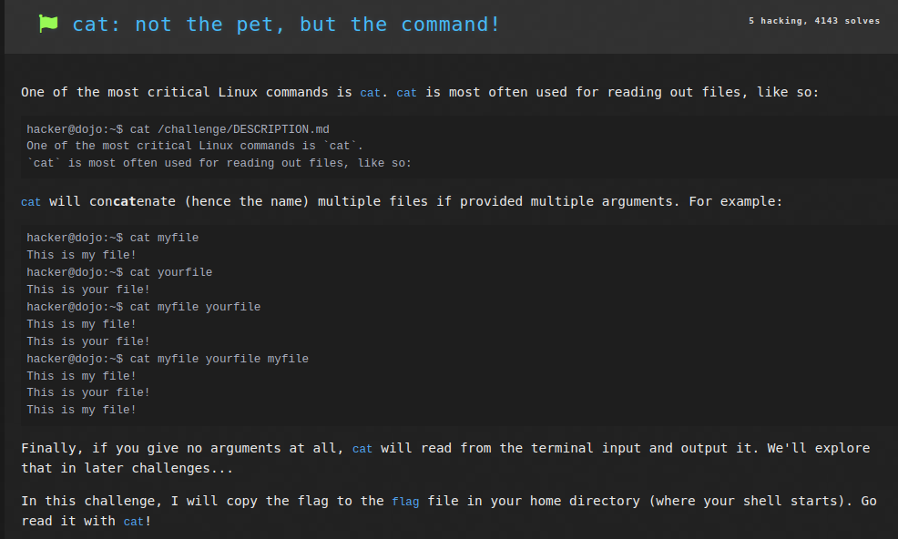

### Approach
1. I connected to the SSH using the command `ssh -i key hacker@pwn.college`.
2. I entered the command `cat flag` to invoke the `cat` command to read the file `/home/hacker/flag` using relative path and the flag was returned.

### Flag
`pwn.college{o7QFOKuZmj5M3bvPiB-6-NpRSka.dFzN1QDLyITO0czW}`

## Challenge 2: catting absolute paths

### Problem Description
A challenge to get the flag by invoking the `cat` command to read the file `/flag` using its absolute path.

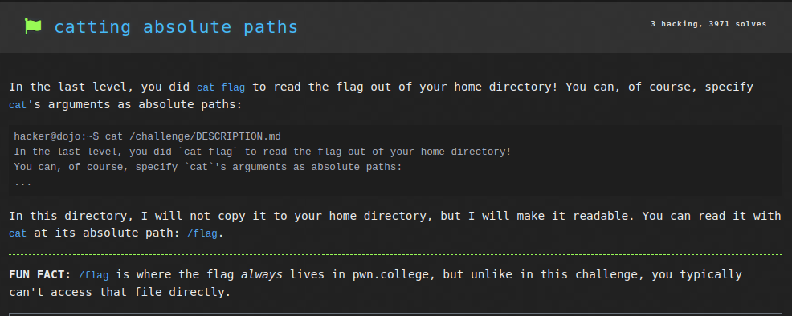

### Approach
1. I connected to the SSH using the command `ssh -i key hacker@pwn.college`.
2. I entered the command `cat /flag` to invoke the `cat` command to read the file `/flag` using absolute path and the flag was returned.

### Flag
`pwn.college{AQgVwKxgm40hUnCpK8SqM8A4Vq5.dlTM5QDLyITO0czW}`

## Challenge 3: more catting practice

### Problem Description
A challenge to get the flag by invoking the `cat` command to read the file `/opt/libslub/flag` using its absolute path.

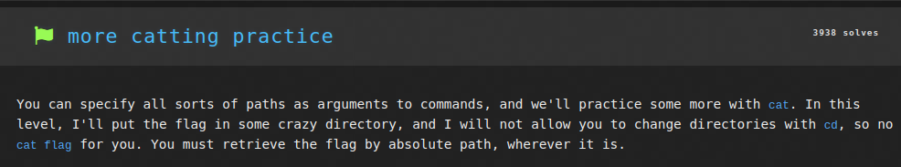

### Approach
1. I connected to the SSH using the command `ssh -i key hacker@pwn.college`.
2. I entered the command `cat /opt/libslub/flag` to invoke the `cat` command to read the file `/opt/libslub/flag` using absolute path and the flag was returned.

### Flag
`pwn.college{sEZSTPTUkZiwQlJX3DnuMBXI7kY.dBjM5QDLyITO0czW}`

## Challenge 4: grepping for a needle in a haystack

### Problem Description
A challenge to get the flag by invoking the `grep` command to find the flag within the `/challenge/data.txt` file.

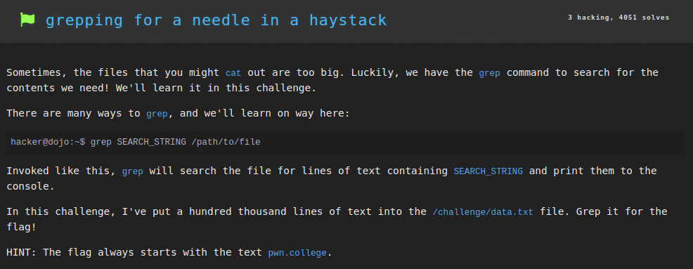

### Approach
1. I connected to the SSH using the command `ssh -i key hacker@pwn.college`.
2. I entered the command `grep pwn.college /challenge/data.txt` to invoke the `grep` command to read the file `/challenge/data.txt` and find the flag (which always begins with `pwn.college`), and the flag was returned.

### Flag
`pwn.college{8zPChAuA5gZcQTfkVjT_IUBIqr1.ddTM4QDLyITO0czW}`

## Challenge 5: listing files

### Problem Description
A challenge to get the flag by listing all files and then to find the files inside `/challenge` directory, one of which would give the flag.

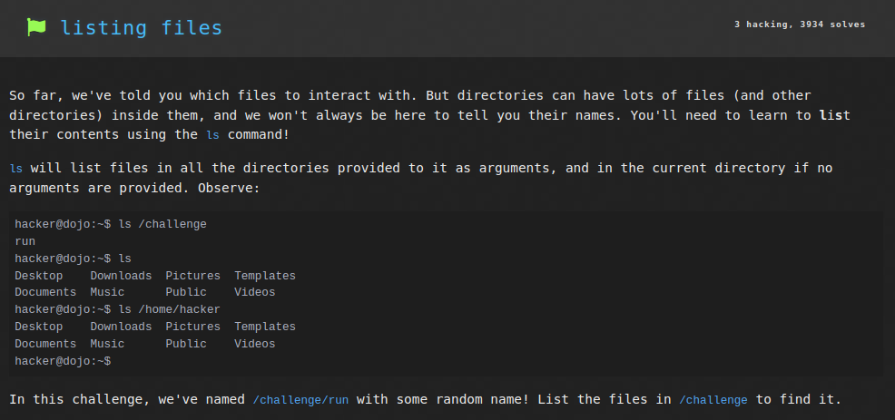

### Approach
1. I connected to the SSH using the command `ssh -i key hacker@pwn.college`.
2. I entered the command `ls /challenge` to list all files within `/challenge` directory. This included a file `DESCRIPTION.md` and `20865-renamed-run-29014` which I understood to contain the flag.
3. I ran the file using the command `/challenge/20865-renamed-run-29014` which returned the flag.

### Flag
`pwn.college{oY7qmrAhxb8YlcbXmqH7ZlvJHOW.dhjM4QDLyITO0czW}`

## Challenge 6: touching files

### Problem Description
A challenge to get the flag by creating two files: `/tmp/pwn` and `/tmp/college`, and then running `/challenge/run` to get the flag

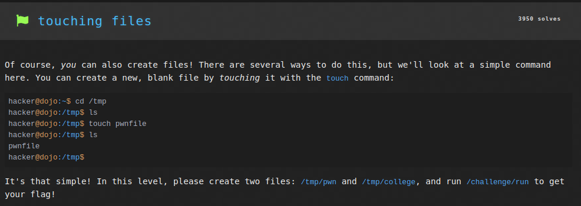

### Approach
1. I connected to the SSH using the command `ssh -i key hacker@pwn.college`.
2. I entered the command `touch /tmp/pwn /tmp/college` to create two files `/tmp/pwn` and `/tmp/college`.
3. I then executed the command `/challenge/run` which returned the flag.

### Flag
`pwn.college{UUAIMLeiIRixxH7J6r6UwMVRyTB.dBzM4QDLyITO0czW}`

## Challenge 7: removing files

### Problem Description
A challenge to get the flag by deleting the file `/home/hacker/delete_me`, and then running `/challenge/check` to get the flag

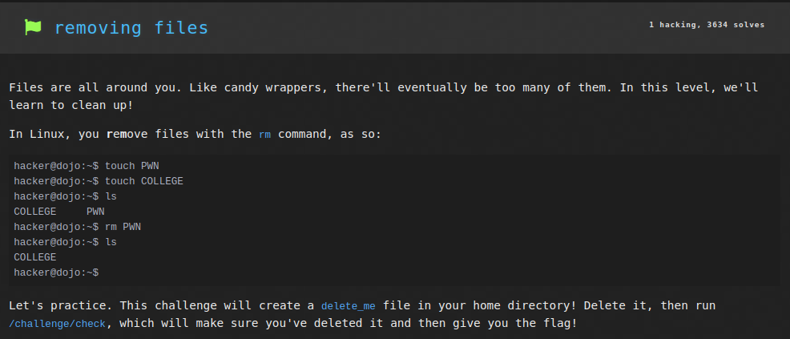

### Approach
1. I connected to the SSH using the command `ssh -i key hacker@pwn.college`.
2. I entered the command `rm delete_me` to delete the `/home/hacker/delete_me` file through its relative path.
3. I then executed the command `/challenge/check` which returned the flag.

### Flag
`pwn.college{o0akk7oto913wL5NvynZ7Xb0sfE.dZTOwUDLyITO0czW}`

## Challenge 8: hidden files

### Problem Description
A challenge to get the flag by listing **all** files, including hidden files to find the files inside `/` directory, one of which would give the flag.

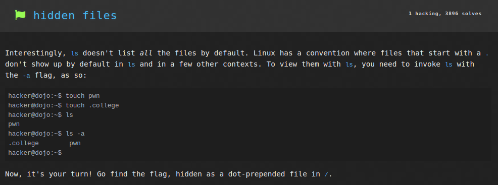

### Approach
1. I connected to the SSH using the command `ssh -i key hacker@pwn.college`.
2. I entered the command `ls -a /` to list all files within `/challenge` directory, including hidden ones. This included a file `.flag-301771244316712` which I understood to contain the flag.
3. I ran the file using the command `cat /.flag-301771244316712` which printed the contents of the file, returning the flag.

### Flag
`pwn.college{AO5jAO86neZp_HfKs-CeMbJX4bG.dBTN4QDLyITO0czW}`

## Challenge 9: An Epic Filesystem Quest

### Problem Description
A challenge to get the flag by listing *all* files, including hidden files to find the files inside `/` directory, one of which would give the flag.

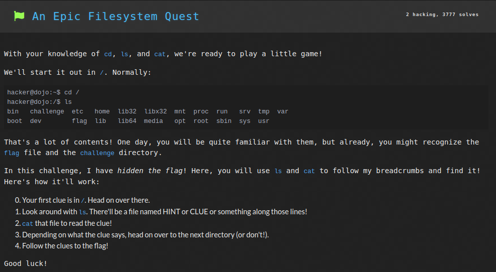

### Approach
1. I connected to the SSH using the command `ssh -i key hacker@pwn.college`.
2. I entered the command `ls /` to list all files in the `/` directory,  including a file `REVELATION`. Then entering `cat /REVELATION` gave me the location of the next clue: `/usr/share/racket/pkgs/srfi-doc/srfi/scribblings/srfi-std` and the clue was also hidden.
3. I ran `ls -a /usr/share/racket/pkgs/srfi-doc/srfi/scribblings/srfi-std` to get the hidden files as well. This gave me a file `.TIP`. Executing the command `cat /usr/share/racket/pkgs/srfi-doc/srfi/scribblings/srfi-std/.TIP` gave me the location of the next clue `/opt/aflplusplus/test`.
4. Listing all files here with `ls /opt/aflplusplus/test` gave me a file `GIST`, `cat /opt/aflplusplus/test/GIST` gave me the location of the next clue `/usr/share/racket/pkgs/scheme-lib/scheme/unit/compiled` which could only be accessed without changing current working directory to the directory.
5. `ls /usr/share/racket/pkgs/scheme-lib/scheme/unit/compiled` gave me file `SNIPPET-TRAPPED`. `cat /usr/share/racket/pkgs/scheme-lib/scheme/unit/compiled/SNIPPET-TRAPPED` gave the next HIDDEN clue in `/usr/share/javascript/mathjax/unpacked/jax/output/HTML-CSS/fonts/Gyre-Termes/Size1`
6. `ls -a /usr/share/javascript/mathjax/unpacked/jax/output/HTML-CSS/fonts/Gyre-Termes/Size1` gave a hidden file `.MEMO`. `cat /usr/share/javascript/mathjax/unpacked/jax/output/HTML-CSS/fonts/Gyre-Termes/Size1/.MEMO` returned the next HIDDEN clue in `/opt/radare2/shlr/spp`.
7. `ls -a /opt/radare2/shlr/spp` gave a hidden file `.NOTE`. `cat /opt/radare2/shlr/spp/.NOTE` returned the next clue in `/opt/linux/linux-5.4/Documentation/devicetree/bindings/spi`.
8. `ls /opt/linux/linux-5.4/Documentation/devicetree/bindings/spi` gave a file `LEAD`, `cat /opt/linux/linux-5.4/Documentation/devicetree/bindings/spi/LEAD` returned the next clue in `/opt/linux/linux-5.4/Documentation/features/time/irq-time-acct` which was DELAYED, i.e. could only be accessed after entering the directory.
9. I used command `cd /opt/linux/linux-5.4/Documentation/features/time/irq-time-acct` to enter the directory. `ls` listed all the files, one of which was `TEASER`. `cat TEASER` returned the next DELAYED clue in `/usr/local/lib/python3.8/dist-packages/angr/angrdb/serializers/__pycache__`
10. I used command `cd /usr/local/lib/python3.8/dist-packages/angr/angrdb/serializers/__pycache__` to enter the directory. `ls` listed all files, one of which was `SECRET`. Running the command `cat SECRET` returned the flag.

### Terminal
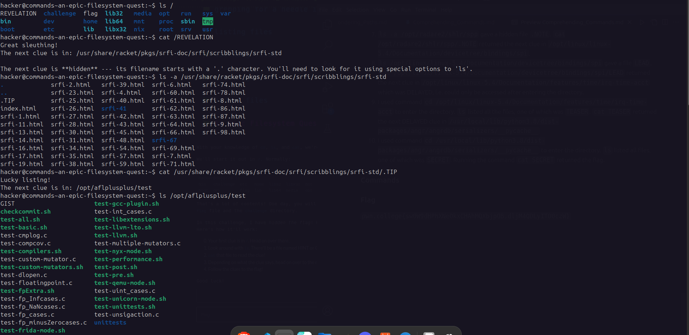
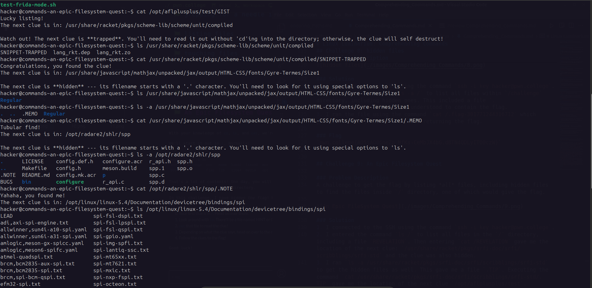
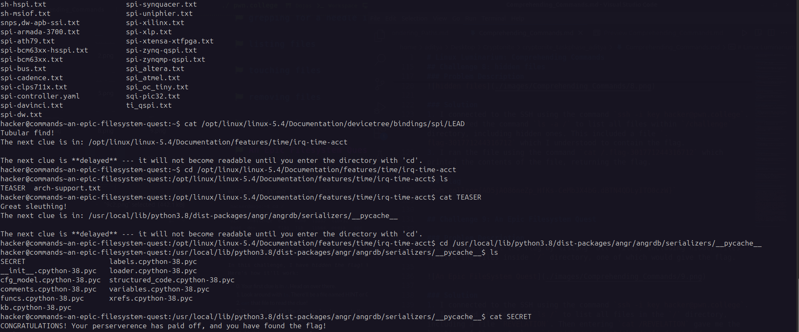

### Flag
`pwn.college{sw0W9dHPhXNeOkxCHAhMQXbjpQ8.dljM4QDLyITO0czW}`

## Challenge 10: making directories

### Problem Description
A challenge to get the flag by creating a directory and a file in that directory, and then running `/challenge/run`.

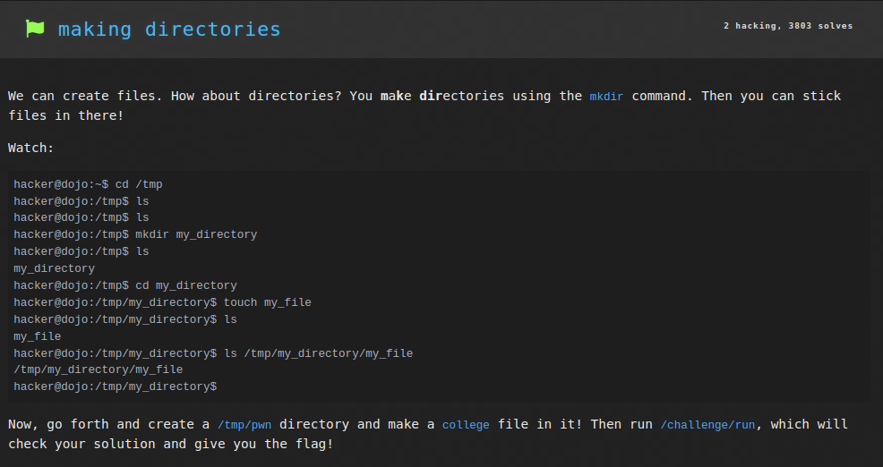

### Approach
1. I connected to the SSH using the command `ssh -i key hacker@pwn.college`.
2. I entered the command `mkdir /tmp/pwn` to create a new directory in `/tmp`.
3. I then entered `touch /tmp/pwn/college` to create file `college` in `/tmp/pwn`
4. Finally the command `/challenge/run` returned the flag.

### Flag
`pwn.college{k2rtpGlS1a8TLfY_Zlv_2WSpdy9.dFzM4QDLyITO0czW}`

# Challenge 11: finding files

### Problem Description
A challenge to get the flag by finding the flag file within the entire filesystem.

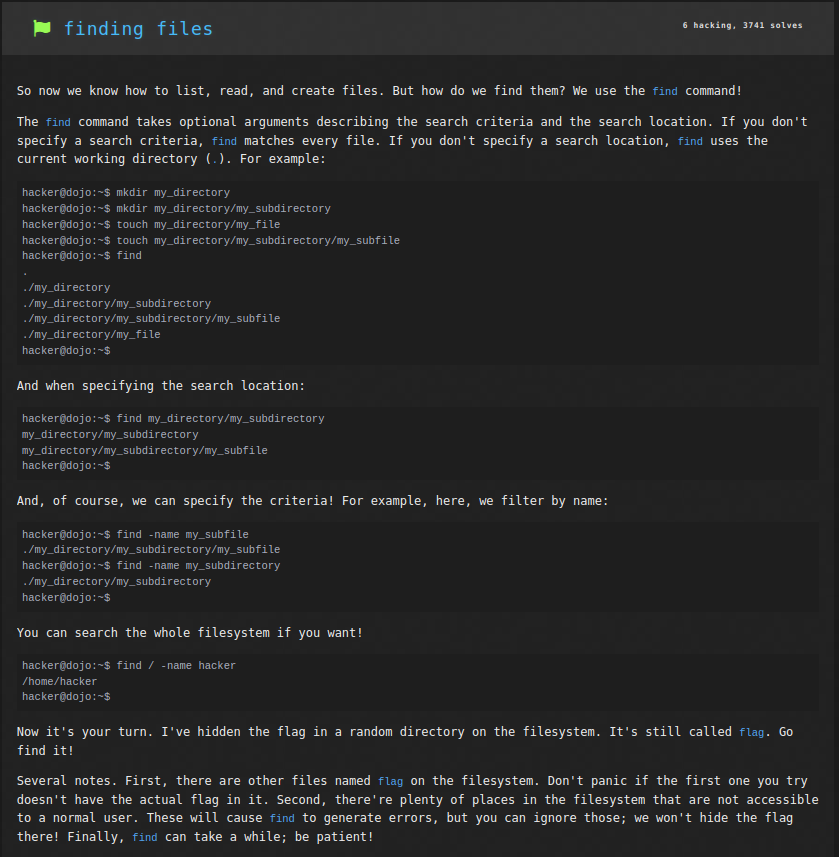

### Approach
1. I connected to the SSH using the command `ssh -i key hacker@pwn.college`.
2. I entered the command `find / -name flag` to to list all files named `flag`. This gave me a list of several different files.
3. I then tried to read each of these files using `cat <filepath>`. For the file `/usr/lib/debug/.build-id/48/flag`, the command `cat /usr/lib/debug/.build-id/48/flag` returned the flag.

### Flag
`pwn.college{gK8m0cdMoXrwDbw3U3Pw0M7PXx0.dJzM4QDLyITO0czW}`

# Challenge 12: linking files

### Problem Description
A challenge to get the flag by reading the file `/flag` using the program `/challenge/catflag` which reads the file `/home/hacker/not-the-flag` through symlinks.

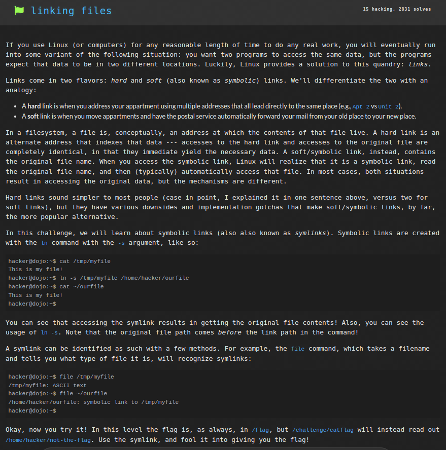

### Approach
1. I connected to the SSH using the command `ssh -i key hacker@pwn.college`.
2. I first entered the command `rm not-the-flag` to delete the `/home/hacker/not-the-flag` file.
3. I then created a new symlink from `/flag` to a new `not-the-flag` file through the command `ln -s /flag not-the-flag`.
4. Now, `/challenge/catflag` accessed `/flag` through the symbolic link `/home/hacker/not-the-flag` and returned the flag.

### Flag
`pwn.college{IcC5m-4FlI4DHa0z7uVWaBplQ9g.dlTM1UDLyITO0czW}`