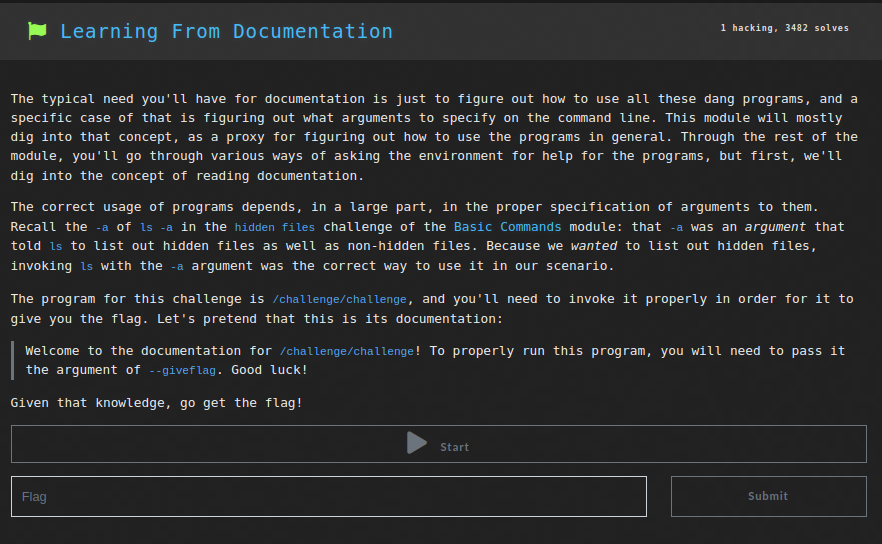
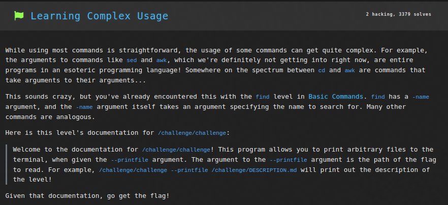
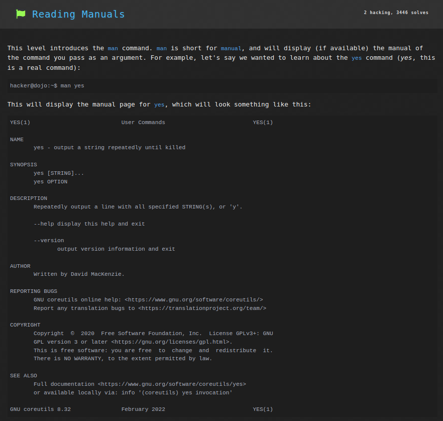
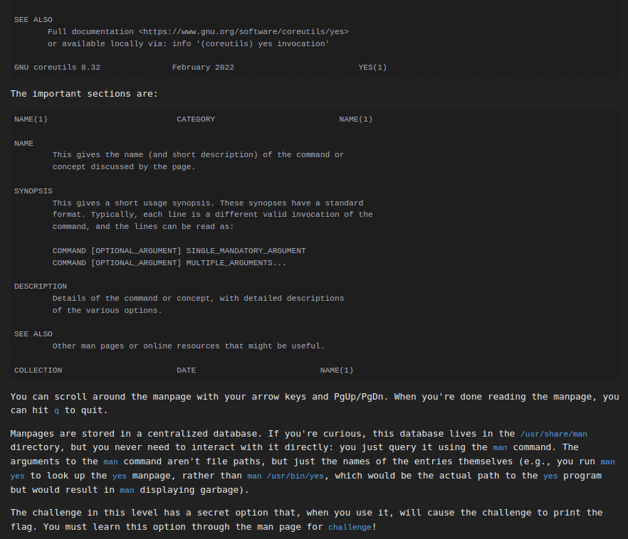
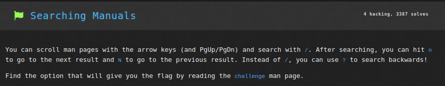
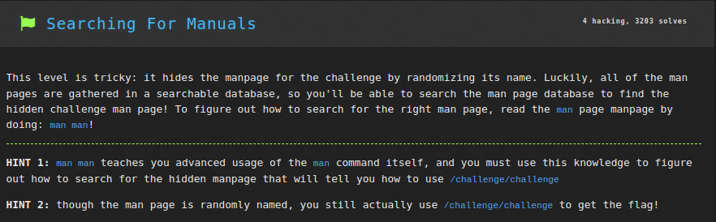
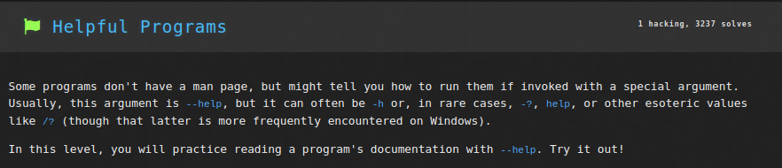
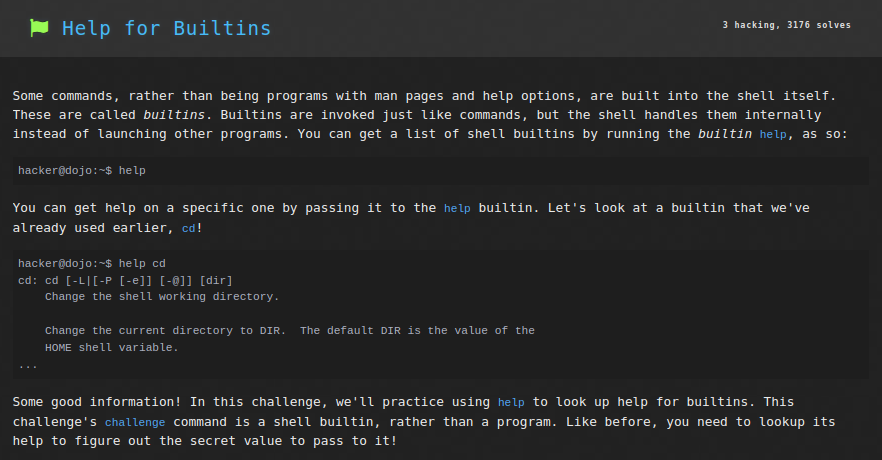

# Linux Luminarium: Digesting Documentation

This write-up covers the solutions for the "Digesting Documentation" module in pwn.college, detailing the thought process and step-by-step solution for each problem.

---

## Challenge 1: Learning from Documentation

### Problem Description
A challenge to get the flag by giving the correct argument `--giveflag` to the command`/challenge/challenge`.

### Approach
1. I connected to the SSH using the command `ssh -i key hacker@pwn.college`.
2. I entered the command `/challenge/challenge --giveflag` to run the `/challenge/challenge` file with `--giveflag` as argument and the flag was returned.

### Flag
`pwn.college{8qtaIirS8SHyyJjo5Wc9E3Pq-dv.dRjM5QDLyITO0czW}`

## Challenge 2: Learning Complex Usage

### Problem Description
A challenge to get the flag by giving the correct argument for `--printfile </path/to/flag>` to the command`/challenge/challenge`.

### Approach
1. I connected to the SSH using the command `ssh -i key hacker@pwn.college`.
2. I entered the command `/challenge/challenge --printfile /flag` to run the `/challenge/challenge` file with `--printfile /flag` as argument. This prints the contents of the `/flag` file which as we already know always contains the flag, hence the flag was returned.

### Flag
`pwn.college{Y7KTreMIIH03PZeVa4o5TLVTwuh.dVjM5QDLyITO0czW}`

## Challenge 3: Reading Manuals

### Problem Description
A challenge to get the flag by giving the correct argument for the command`/challenge/challenge`.

### Approach
1. I connected to the SSH using the command `ssh -i key hacker@pwn.college`.
2. I entered the command `man challenge` to get the manpage for the `/challenge/challenge` file. This gave me the manpage, in which there was an argument `--okmcas NUM` which prints the flag if `NUM` is `843`.
3. Thus, running `/challenge/challenge --okmcas 843` printed the flag.
### Flag
`pwn.college{Q8V4X39o09KX3kRT5mc2aG-sV4Q.dRTM4QDLyITO0czW}`

## Challenge 4: Searching Manuals

### Problem Description
A challenge to get the flag by giving the correct argument for the command`/challenge/challenge` by searching the manpage for `challenge` for the argument.

### Approach
1. I connected to the SSH using the command `ssh -i key hacker@pwn.college`.
2. I entered the command `man challenge` to get the manpage for the `/challenge/challenge` file. This gave me the manpage, in which there were many arguments. I searched for the argument which would give me the flag, by entering `/flag` and then pressing `n` till I got the correct argument `--onvdcz`.
3. Thus, running `/challenge/challenge --onvdcz` printed the flag.
### Flag
`pwn.college{IaNM8ni5pFZIVJigO1NrpTJmxEA.dVTM4QDLyITO0czW}`

## Challenge 5: Searching For Manuals

### Problem Description
A challenge to get the flag by giving the correct argument for the command`/challenge/challenge` by searching the `man` page manpage for the argument.

### Approach
1. I connected to the SSH using the command `ssh -i key hacker@pwn.college`.
2. I entered the command `man man` to get the manpage for `man`. This gave me the manpage, in which there were several arguments, one of which is `-K` or `--global-apropos`, which allows to search for text in all manual pages.
3. I searched for `challenge` in all manual pages through `man -K challenge`. This gave me the `challenge` manpage. This contained an argument `--fytmjq NUM` which would return flag if `NUM` is `687`.
4. Thus, running `/challenge/challenge --fytmjq 687` printed the flag.
### Flag
`pwn.college{EIf68ytmjV7qGexFf2yqGsHAau7.dZTM4QDLyITO0czW}`

## Challenge 6: Helpful Programs

### Problem Description
A challenge to get the flag by giving the correct argument for the command`/challenge/challenge` by using the `--help` argument.

### Approach
1. I connected to the SSH using the command `ssh -i key hacker@pwn.college`.
2. I entered the command `/challenge/challenge --help` to get the list of arguments I could provide. One of these was `-g GIVE_THE_FLAG` which gives the flag if correct value is provided for `GIVE_THE_FLAG`; and another one was `-p` which prints this correct value to be entered.
3. I ran the command `/challenge/challenge -p` to get the secret value. This returned a value of `454`.
4. Thus, running `/challenge/challenge -g 454` printed the flag.
### Flag
`pwn.college{4rDUr5bmQqrZ4rHGvLD46liDLET.ddjM4QDLyITO0czW}`

## Challenge 7: Help for Builtins

### Problem Description
A challenge to get the flag by giving the correct argument for the shell command `challenge` by using the `help` builtin command.

### Approach
1. I connected to the SSH using the command `ssh -i key hacker@pwn.college`.
2. I entered the command `help challenge` to get the list of arguments I could provide. One of these was `--secret VALUE` which gives the flag if correct value is provided for `VALUE` i.e. `8M8Xed-`.
3. Thus, running `challenge --secret 8M8Xed-` printed the flag.
### Flag
`pwn.college{8M8XMed-wWH8TcHe3sssViYDT-f.dRTM5QDLyITO0czW}`