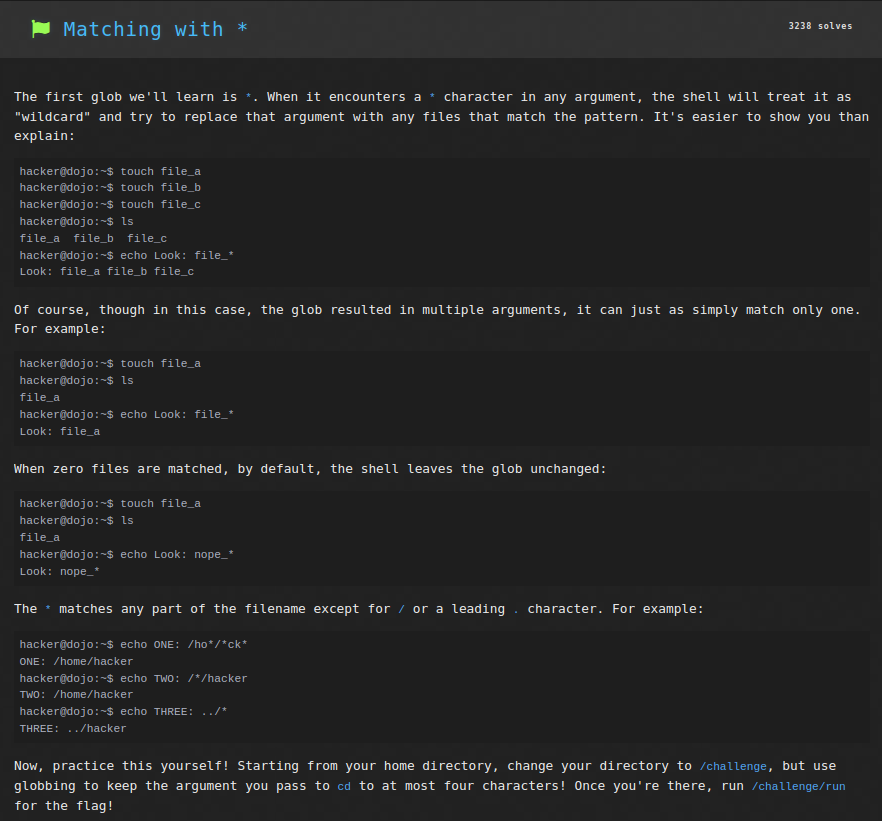
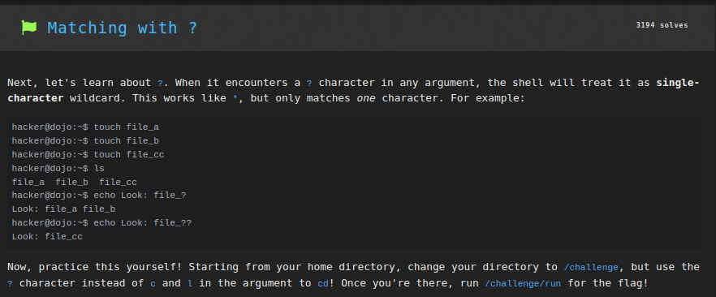
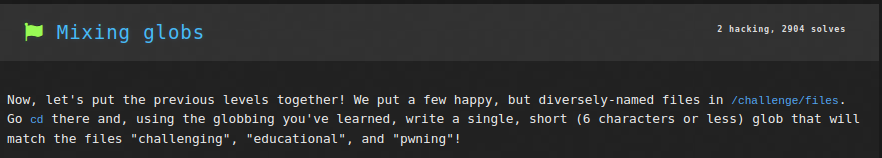
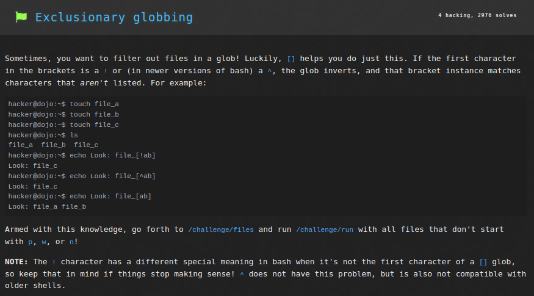

# Linux Luminarium: File Globbing

This write-up covers the solutions for the "File Globbing" module in pwn.college, detailing the thought process and step-by-step solution for each problem.

---

## Challenge 1: Matching with *

### Problem Description
A challenge to get the flag by running `/challenge/run` from the working directory `/challenge` by cd'ing into it using only 4 characters for the file path.

### Approach
1. I connected to the SSH using the command `ssh -i key hacker@pwn.college`.
2. I entered the command `cd /*ge` to change current working directory to `/challenge/` using wildcard `*`.
3. Now the command `./run` printed the flag.

### Flag
`pwn.college{k3uGno-DkqDTeV1v2Z8qisq5qqh.dFjM4QDLyITO0czW}`

## Challenge 2: Matching with ?

### Problem Description
A challenge to get the flag by running `/challenge/run` from the working directory `/challenge` by cd'ing into it using `?` character instead of 'c' and 'l'.

### Approach
1. I connected to the SSH using the command `ssh -i key hacker@pwn.college`.
2. I entered the command `cd /?ha??enge` to change current working directory to `/challenge/` using single-character wildcard `?`.
3. Now the command `./run` printed the flag.

### Flag
`pwn.college{8gWh8WIZZvufjaOKrkC9Y0vxIbx.dJjM4QDLyITO0czW}`

## Challenge 3: Matching with []

### Problem Description
A challenge to get the flag by running `/challenge/run` from the working directory `/challenge/files` and giving argument through bracket-glob which includes files `file_a`, `file_b`, `file_s` and `file_h`.

![Matching with []](./images/File_Globbing/3.png)

### Approach
1. I connected to the SSH using the command `ssh -i key hacker@pwn.college`.
2. I entered the command `cd /challenge/files` to change current working directory.
3. Now the command `/challenge/run file_[bash]` executed the `run` program in `/challenge` with the argument `file_[bash]` thus returning the flag.

### Flag
`pwn.college{Ex1KDHXwec_YXIWUs5mJ_KHDge0.dNjM4QDLyITO0czW}`

## Challenge 4: Matching paths with []

### Problem Description
A challenge to get the flag by running `/challenge/run` and giving argument through bracket-glob which includes absolute paths to files `file_a`, `file_b`, `file_s` and `file_h`.

![Matching paths with []](./images/File_Globbing/4.png)

### Approach
1. I connected to the SSH using the command `ssh -i key hacker@pwn.college`.
2. Now the command `/challenge/run /challenge/files/file_[bash]` executed the `run` program in `/challenge` with the argument `/challenge/files/file_[bash]` thus returning the flag.

### Flag
`pwn.college{Iob8nEU5BBizl-TDmU_coHAagkq.dRjM4QDLyITO0czW}`

## Challenge 5: Mixing globs

### Problem Description
A challenge to get the flag by running `/challenge/run` from the working directory `/challenge/files` and giving argument through globs which includes files `challenging`, `educational` and `pwning`.

### Approach
1. I connected to the SSH using the command `ssh -i key hacker@pwn.college`.
2. I entered the command `cd /challenge/files` to change current working directory.
3. Now the command `/challenge/run [cep]*` executed the `run` program in `/challenge` with the argument `[cep]*`. The `[cep]*` argument includes all files which start with 'c','e', or 'p', thus returning the flag.

### Flag
`pwn.college{EqAai88T6hjYuYMcY1x40xsOJCR.dVjM4QDLyITO0czW}`

## Challenge 6: Exclusionary globbing

### Problem Description
A challenge to get the flag by running `/challenge/run` from the working directory `/challenge/files` and giving argument through globs which includes files not starting from 'p','w', or 'n'.

### Approach
1. I connected to the SSH using the command `ssh -i key hacker@pwn.college`.
2. I entered the command `cd /challenge/files` to change current working directory.
3. Now the command `/challenge/run [^pwn]*` executed the `run` program in `/challenge` with the argument `[^pwn]*`. The `[^pwn]*` argument includes all files which do NOT start with 'p','w', or 'n', thus returning the flag.

### Flag
`pwn.college{I4NcoY6IMDqMwgP0PuO-xAwAEXh.dZjM4QDLyITO0czW}`