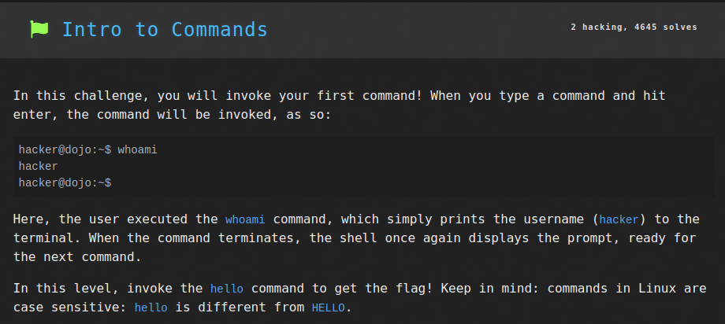

# Linux Luminarium: Hello Hackers

This write-up covers the solutions for the "Hello Hackers" module in pwn.college, detailing the thought process and step-by-step solution for each problem.

---

## Challenge 1: Intro To Commands

### Problem Description
A simple challenge to get the flag by executing the `hello` command.

### Approach
1. I connected to the SSH using the command `ssh -i key hacker@pwn.college`.
2. I entered the `hello` command and the flag was returned.

### Flag
`pwn.college{gfylmjqYKWiP99DXBY62S3zxar8.ddjNyUDLyITO0czW}`

## Challenge 2: Intro To Arguments

### Problem Description
A simple challenge to get the flag by executing the `hello` command with the `hackers` argument.

### Approach
1. I connected to the SSH using the command `ssh -i key hacker@pwn.college`.
2. I entered the command `hello hackers` and the flag was returned.

### Flag
`pwn.college{Q5vUI77TaSsbXv7ImuxlqDGUpWN.dhjNyUDLyITO0czW}`