# Linux Luminarium: Perceiving Permissions

This write-up covers the solutions for the "Perceiving Permissions" module in pwn.college, detailing the thought process and step-by-step solution for each problem.

---

## Challenge 1: Changing File Ownership

### Problem Description
A challenge to get the flag by changing the ownership of the file `/flag` from `root` user to the `hacker` user and then reading it.

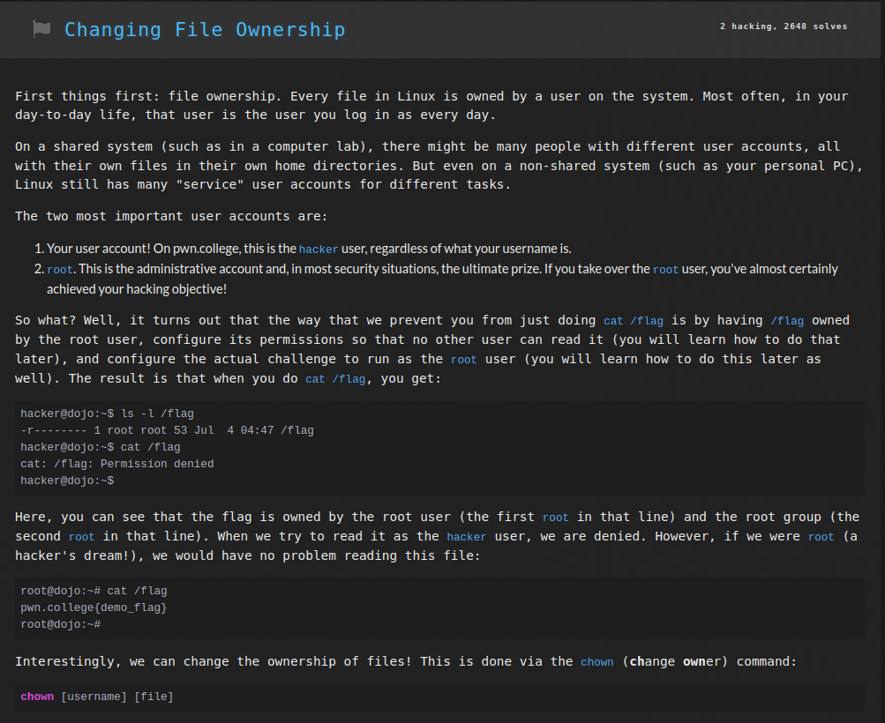
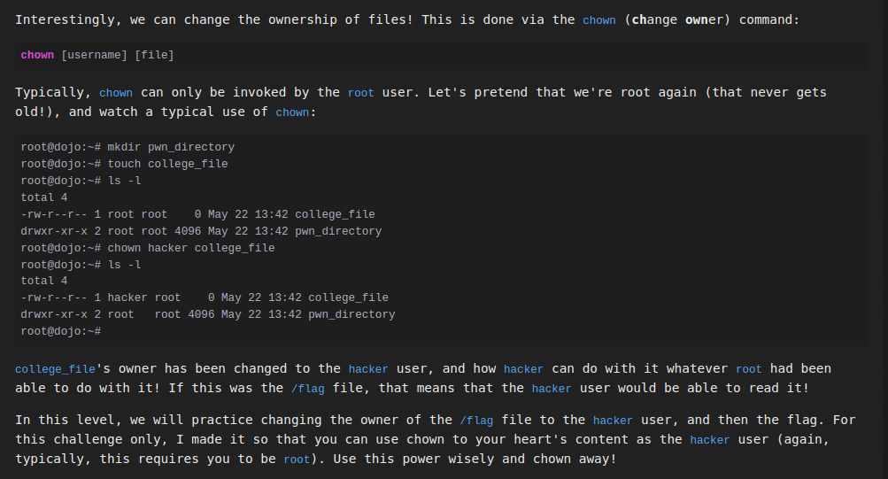

### Approach
1. I connected to the SSH using the command `ssh -i key hacker@pwn.college`.
2. I entered the command `chown hacker /flag` to change the ownership of `/flag` to the `hacker` user.
3. Now running the program through the command `cat /flag` reads the file `/flag` and hence returns the flag.

### Flag
`pwn.college{QD6pQYp0ofMlYI4GG-K2c_a4z22.dFTM2QDLyITO0czW}`

## Challenge 2: Groups and Files

### Problem Description
A challenge to get the flag by changing the group ownership of the file `/flag` from `root` group to `hacker` and then reading it.

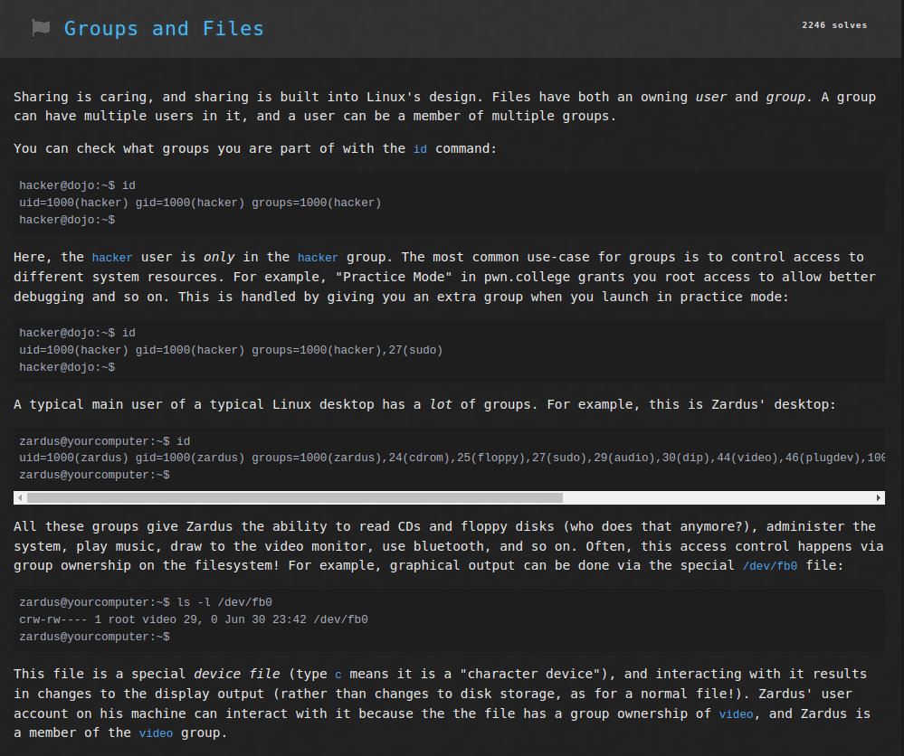
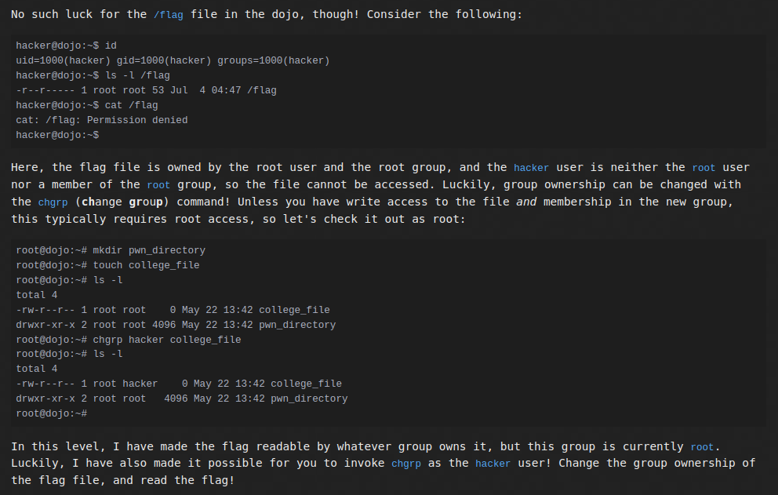

### Approach
1. I connected to the SSH using the command `ssh -i key hacker@pwn.college`.
2. I entered the command `chgrp hacker /flag` to change the group ownership of `/flag` to include the `hacker` user.
3. Now running the program through the command `cat /flag` reads the file `/flag` and hence returns the flag.

### Flag
`pwn.college{ovAv7I1fpQu9fDgZlMK5Wtci4Pe.dFzNyUDLyITO0czW}`

## Challenge 3: Fun with Groups Names

### Problem Description
A challenge to get the flag by changing the group ownership of the file `/flag` from `root` group to `hacker` and then reading it.

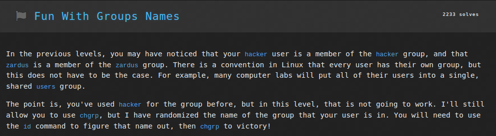

### Approach
1. I connected to the SSH using the command `ssh -i key hacker@pwn.college`.
2. The command `id` provided a list of all groups the user `hacker` is a part of, one of which was `grp3647`.
3. I entered the command `chgrp grp3647 /flag` to change the group ownership of `/flag` to the above group.
4. Now running the program through the command `cat /flag` reads the file `/flag` and hence returns the flag.

### Flag
`pwn.college{IEy3HzrBNBX_C4zxu6k8pfCLOrB.dJzNyUDLyITO0czW}`

## Challenge 4: Changing Permissions

### Problem Description
A challenge to get the flag by changing the read permissions of the file `/flag` to allow `hacker` user to read it.

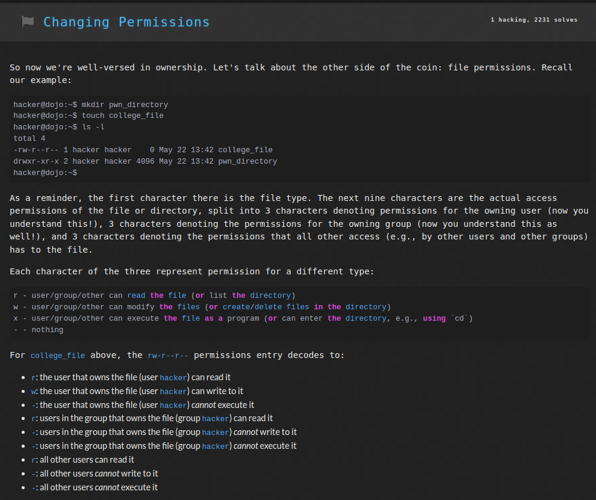
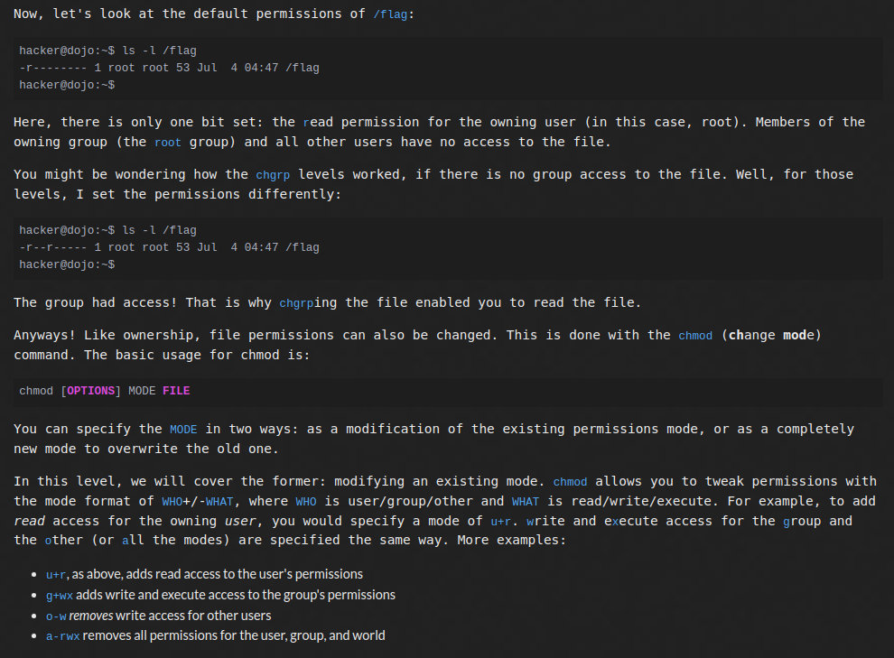
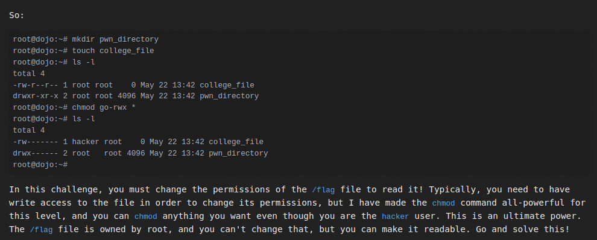

### Approach
1. I connected to the SSH using the command `ssh -i key hacker@pwn.college`.
2. The command `ls -l /flag` provided all permissions of the `/flag` file, through which I learnt that only the owner i.e. `root` has read permissions.
3. I entered the command `chmod o+r /flag` to give read permission to other groups (including `hacker`) other than the `root` group.
4. Now running the program through the command `cat /flag` reads the file `/flag` and hence returns the flag.

### Flag
`pwn.college{01x37l0n4KVRsRij7k3PZc8lxPA.dNzNyUDLyITO0czW}`

## Challenge 5: Executable Files

### Problem Description
A challenge to get the flag by making the file `/flag` executable by the `hacker` user.

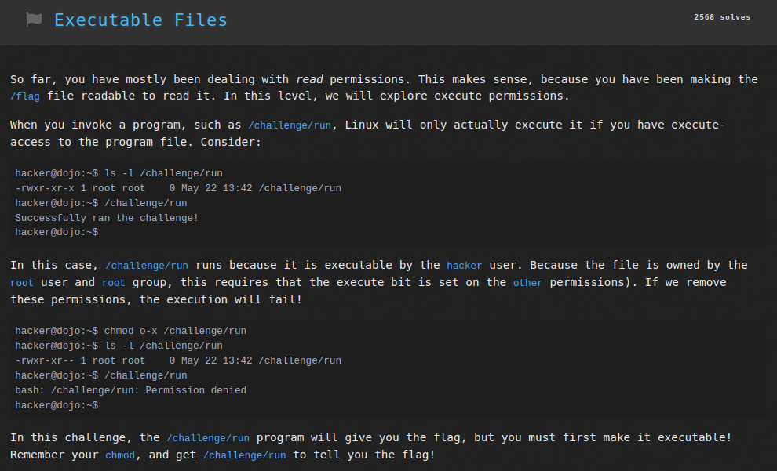

### Approach
1. I connected to the SSH using the command `ssh -i key hacker@pwn.college`.
2. The command `ls -l /challenge/run` provided all permissions of the `/challenge/run` file, through which I learnt that the owner i.e. `hacker`, the `hacker` group and all other groups have read permissions.
3. I entered the command `chmod u+x /challenge/run` to give execute permission to the owner i.e. `hacker`.
4. Now running the program through the command `/challenge/run` returns the flag.

### Flag
`pwn.college{ssVpKyroI0l6Q3b2Uw1t4vKVTSA.dJTM2QDLyITO0czW}`

## Challenge 6: Permission Tweaking Practice

### Problem Description
A challenge to get the flag by completing a series of challenges to change file permissions.

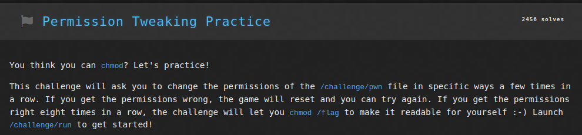

### Approach
1. I connected to the SSH using the command `ssh -i key hacker@pwn.college`.
2. The command `/challenge/run` began the challenge.
3. For the 0th round, I had to change the permissions of `/challenge/pwn` from `rw-r--r--` to `rw-------` so I entered the command `chmod go-r /challenge/pwn`.
4. For the 1st round, I had to change the permissions of `/challenge/pwn` from `rw-------` to `rw-rw-rw-` so I entered the command `chmod go+rw /challenge/pwn`.
5. For the 2nd round, I had to change the permissions of `/challenge/pwn` from `rw-rw-rw-` to `---------` so I entered the command `chmod a-rwx /challenge/pwn`.
6. For the 3rd round, I had to change the permissions of `/challenge/pwn` from `---------` to `-----x---` so I entered the command `chmod g+x /challenge/pwn`.
7. For the 4th round, I had to change the permissions of `/challenge/pwn` from `-----x---` to `-----xrwx` so I entered the command `chmod o+rwx /challenge/pwn`.
8. For the 5th round, I had to change the permissions ofI`/challenge/pwn` from `-----xrwx` to `r----xrwx` so I entered the command `chmod u+r /challenge/pwn`.
9. For the 6th round, I had to change the permissions of `/challenge/pwn` from `r----xrwx` to `r-----rwx` so I entered the command `chmod g-x /challenge/pwn`.
10. For the final round, I had to change the permissions of `/challenge/pwn` from `r-----rwx` to `---------` so I entered the command `chmod a-rwx /challenge/pwn`.
11. After all the challenges were solved, it was shown that the `/flag` file has permissions set to `---------`. I then used `chmod a+r /flag` to enable read permissions to the file for all users and groups.
12. Now `cat /flag` command returned the flag.

### Terminal
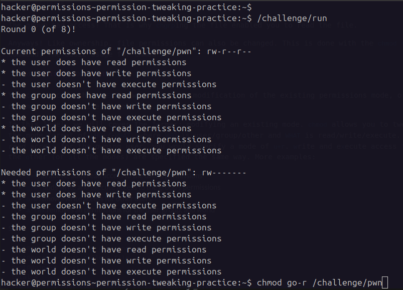
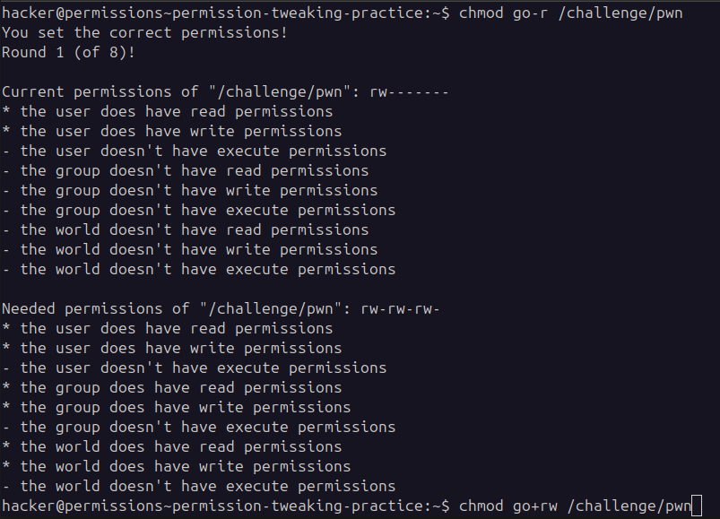
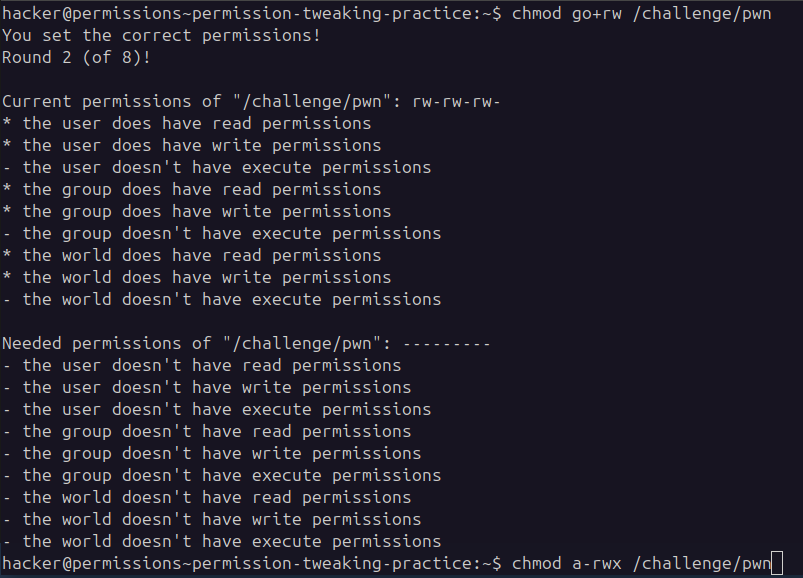
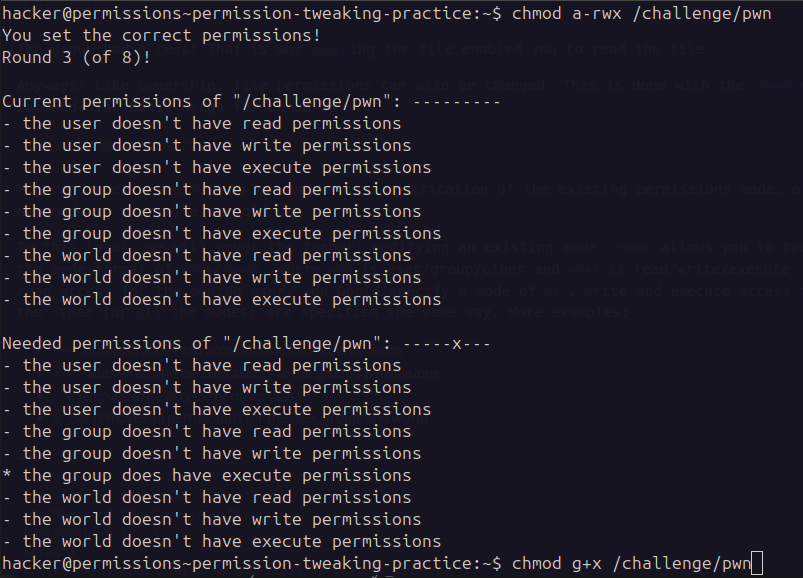
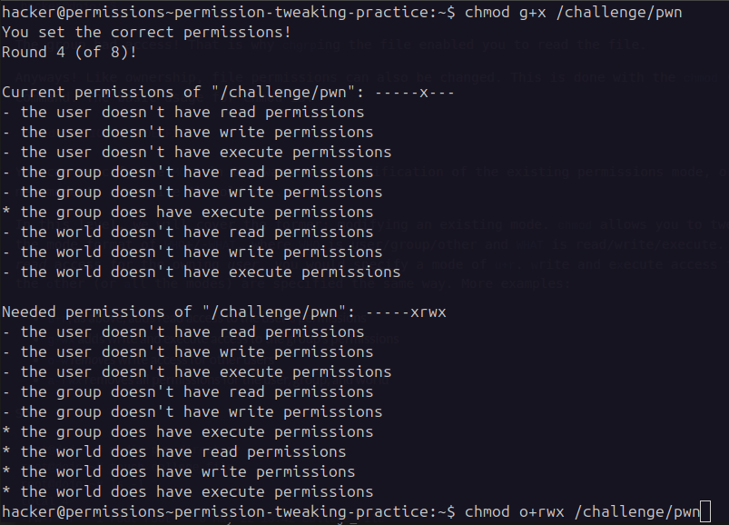
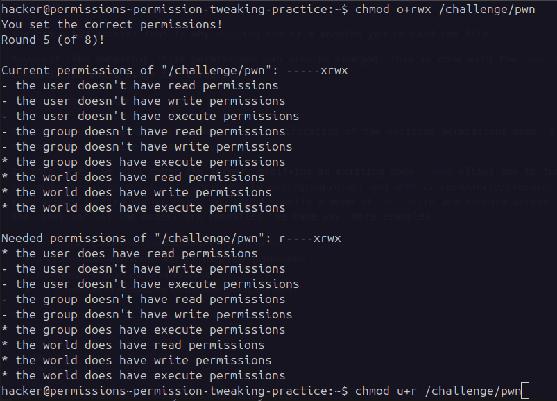
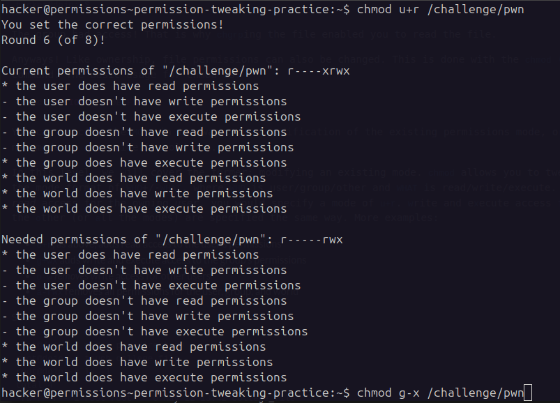
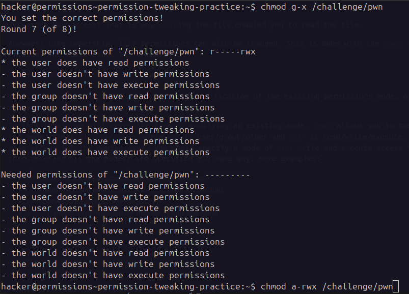
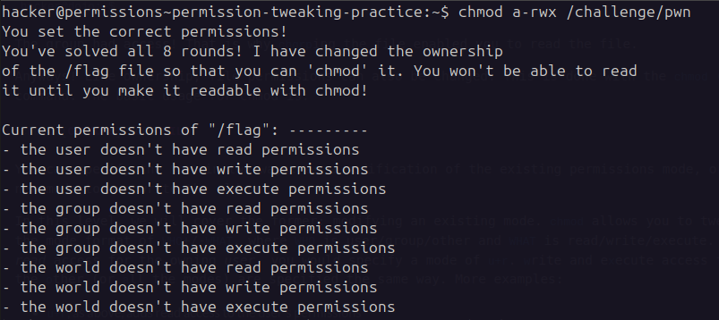
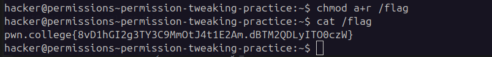

### Flag
`pwn.college{8vD1hGI2g3TY3C9MmOtJ4t1E2Am.dBTM2QDLyITO0czW}`

## Challenge 7: Permission Setting Practice

### Problem Description
A challenge to get the flag by completing a series of challenges to change file permissions.

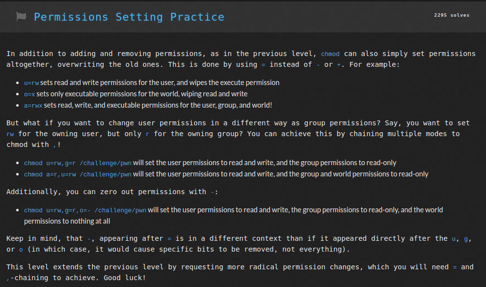

### Approach
1. I connected to the SSH using the command `ssh -i key hacker@pwn.college`.
2. The command `/challenge/run` began the challenge.
3. For the 0th round, I had to change the permissions of `/challenge/pwn` from `rw-r--r--` to `---rwxrw-` so I entered the command `chmod u=-,g=rwx,o=rw /challenge/pwn`.
4. For the 1st round, I had to change the permissions of `/challenge/pwn` from `---rwxrw-` to `r-x--x---` so I entered the command `chmod u=rx,g=x,o=- /challenge/pwn`.
5. For the 2nd round, I had to change the permissions of `/challenge/pwn` to `-wx-----x` so I entered the command `chmod u=wx,g=-,o=x /challenge/pwn`.
6. For the 3rd round, I had to change the permissions of `/challenge/pwn` to `rw--wx--x` so I entered the command `chmod u=rw,g=wx,o=x /challenge/pwn`.
7. For the 4th round, I had to change the permissions of `/challenge/pwn` to `---r-x-w-` so I entered the command `chmod u=-,g=rx,o=w /challenge/pwn`.
8. For the 5th round, I had to change the permissions of `/challenge/pwn` to `rw--wx---` so I entered the command `chmod u=rw,g=wx,o=- /challenge/pwn`.
9. For the 6th round, I had to change the permissions of `/challenge/pwn` to `-w---xrw-` so I entered the command `chmod u=w,g=x,o=rw /challenge/pwn`.
10. For the final round, I had to change the permissions of `/challenge/pwn` to `rwxrwxrw-` so I entered the command `chmod ug=rwx,o=rw /challenge/pwn`.
11. After all the challenges were solved, it was shown that the `/flag` file has permissions set to `---------`. I then used `chmod a=r /flag` to enable read permissions to the file for all users and groups.
12. Now `cat /flag` command returned the flag.

### Terminal
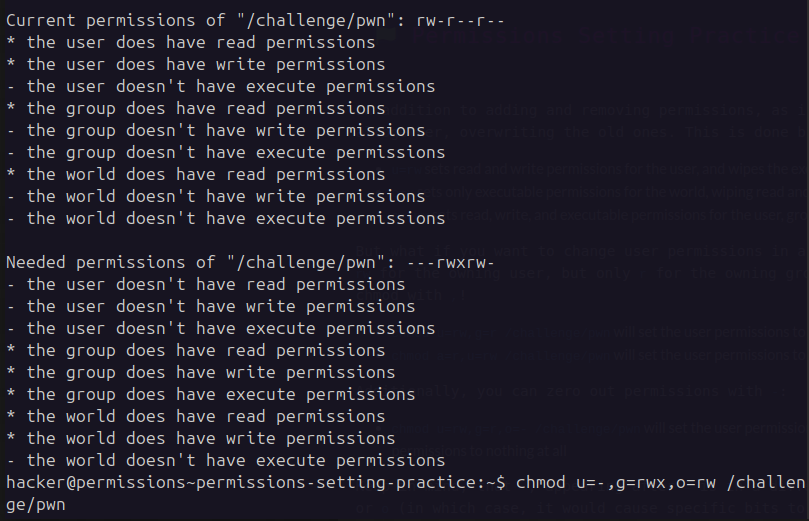
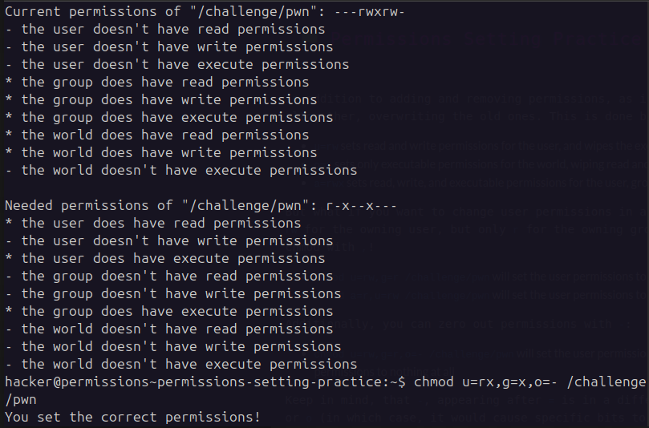
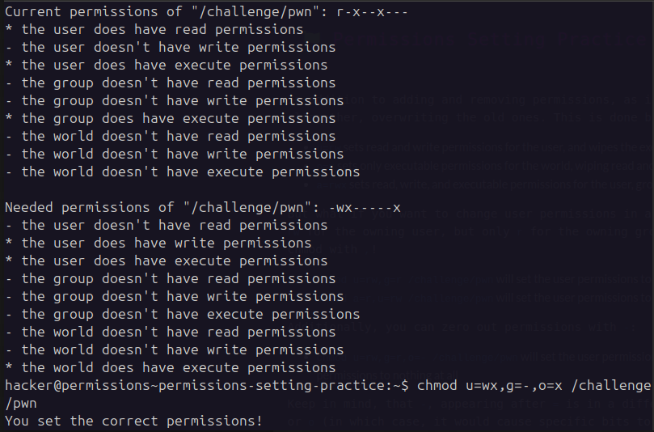
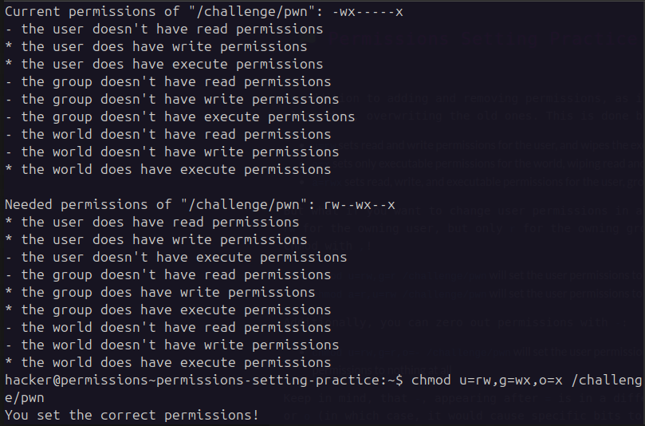
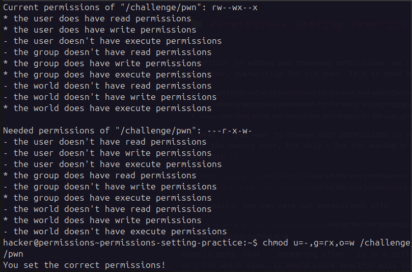
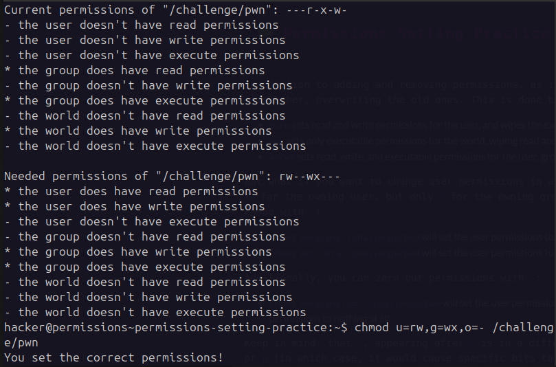
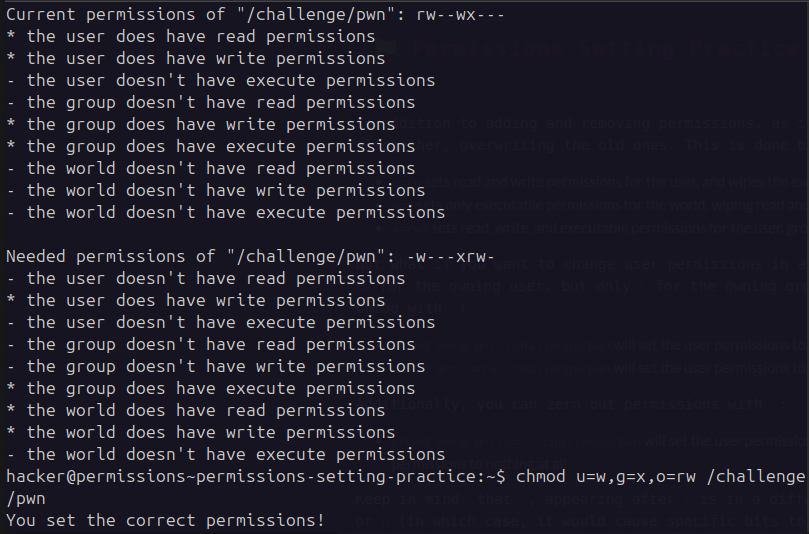
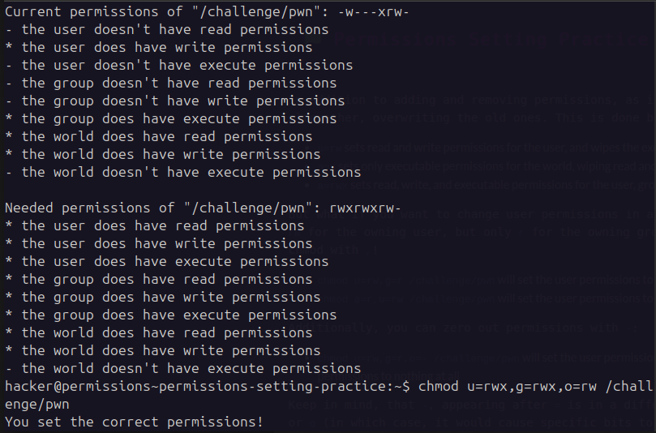
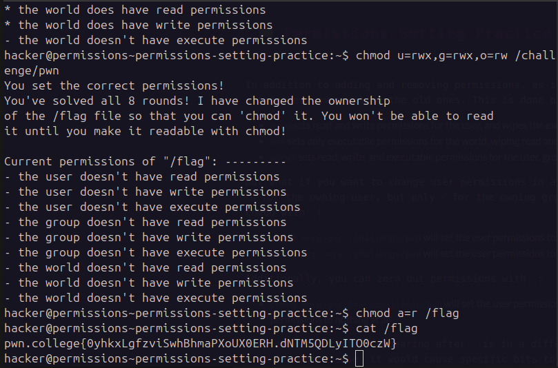

### Flag
`pwn.college{0yhkxLgfzviSwhBhmaPXoUX0ERH.dNTM5QDLyITO0czW}`

## Challenge 8: The SUID Bit

### Problem Description
A challenge to get the flag by making the file `/challenge/getroot` executable as the owner through SUID.

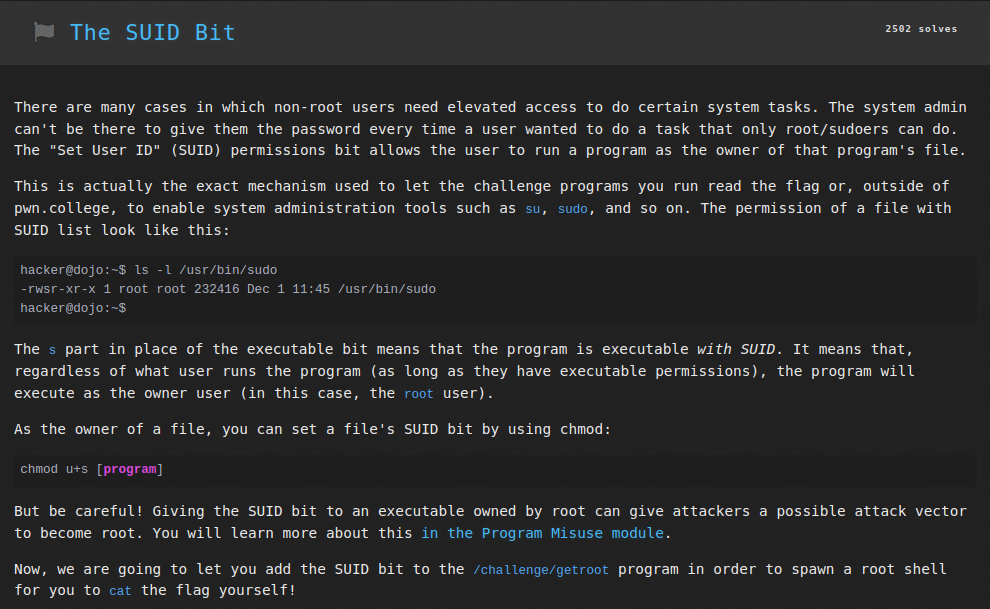

### Approach
1. I connected to the SSH using the command `ssh -i key hacker@pwn.college`.
2. The command `chmod u+s /challenge/getroot` set the SUID bit for the file `/challenge/getroot`, allowing me to run it as the `root`(owner) user.
3. I entered the command `/challenge/getroot` to run the file as owner and this ran a new shell as root.
4. Now reading the `/flag` as `root` user through the command `cat /flag` returns the flag.

### Flag
`pwn.college{wmsBNsrH7Hd2Fg-EZyT5ZCaZReh.dNTM2QDLyITO0czW}`
