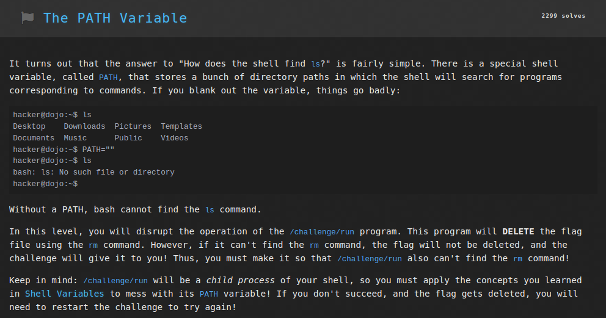
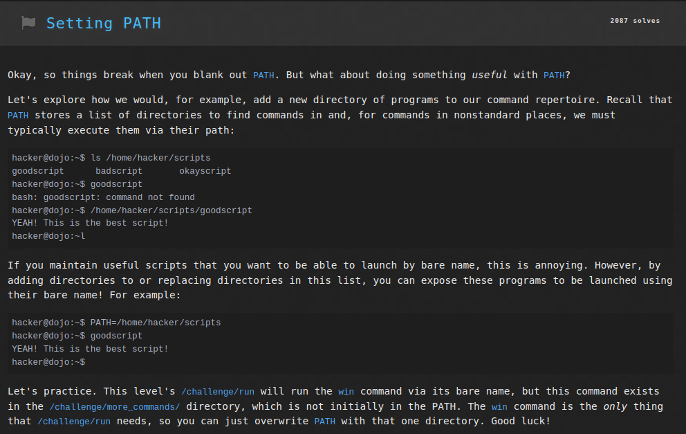
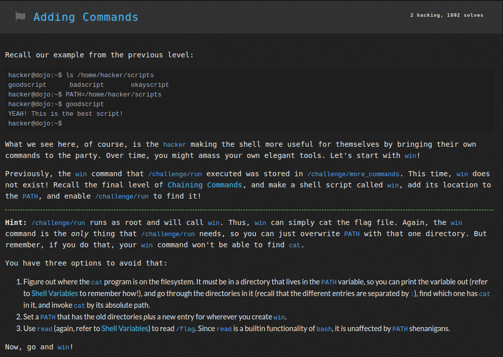
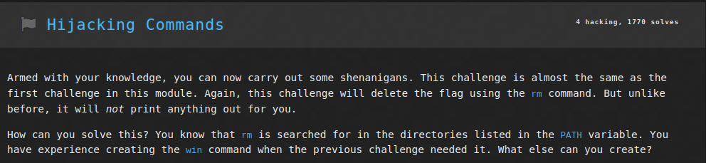

# Linux Luminarium: Pondering PATH

This write-up covers the solutions for the "Pondering PATH" module in pwn.college, detailing the thought process and step-by-step solution for each problem.

---

## Challenge 1: The PATH Variable

### Problem Description
A challenge to get the flag by running the program `/challenge/run` but preventing it from removing the flag file first.

### Approach
1. I connected to the SSH using the command `ssh -i key hacker@pwn.college`.
2. I entered the command `PATH=""` to empty the value of the PATH environment variable.
3. Now when I run `/challenge/run`, it cannot find the `rm` command through the PATH, and hence the flag is not removed but returned.

### Flag
`pwn.college{kvpzmp2KFjrwjub-JNUS3xNcAmq.dZzNwUDLyITO0czW}`

## Challenge 2: Setting PATH

### Problem Description
A challenge to get the flag by running the program `/challenge/run` which runs the command `win`, after adding the directory holding program `win` to PATH.

### Approach
1. I connected to the SSH using the command `ssh -i key hacker@pwn.college`.
2. I entered the command `PATH=/challenge/more_commands` to set the value of PATH to the directory containing command `win`.
3. Now when I run `/challenge/run`, it calls `win` command through the PATH, and hence the flag is returned.

### Flag
`pwn.college{IMFieSNXmgYj5SaqAzcRUhUbjbJ.dVzNyUDLyITO0czW}`

## Challenge 3: Adding Commands

### Problem Description
A challenge to get the flag by running the program `/challenge/run` which runs the command `win`, after creating the `win` shell script and then adding the directory holding program `win` to PATH.

### Approach
1. I connected to the SSH using the command `ssh -i key hacker@pwn.college`.
2. I entered the command `nano win` to make & edit the file `win` in the command line text editor.
3. Within the file `win` I wrote the commands `read f < /flag` and `echo $f` and saved the shell script using `CTRL+X`.
4. Now the command `chmod a+x win` made the shell script executable.
5. I then used the command `PATH=/home/hacker` to add the parent directory of `win` to the PATH.
6. Finally, executing `/challenge/run` invoked `win` from the PATH, which read the `/flag` file hence returning the flag.

### Flag
`pwn.college{Uvl3dJzbyYkUeZB5V863WSmAvOP.dZzNyUDLyITO0czW}`

## Challenge 4: Hijacking Commands

### Problem Description
A challenge to get the flag by running the program `/challenge/run` which runs the command `rm` which is to be hijacked to print the flag instead of deleting it.

### Approach
1. I connected to the SSH using the command `ssh -i key hacker@pwn.college`.
2. I entered the command `nano rm` to make & edit the file `rm` in the command line text editor.
3. Within the file `rm` I wrote the commands `read f < /flag` and `echo $f` and saved the shell script using `CTRL+X`.
4. Now the command `chmod a+x rm` made the shell script executable.
5. I then used the command `PATH=/home/hacker` to add the parent directory of `rm` to the PATH, and delete all other directories (including the one holding original `rm` script).
6. Finally, executing `/challenge/run` invoked `/home/hacker/rm` from the PATH, which read the `/flag` file hence returning the flag.

### Flag
`pwn.college{IP8KNF75yOUj44R--3aWzdu_Uoz.ddzNyUDLyITO0czW}`
