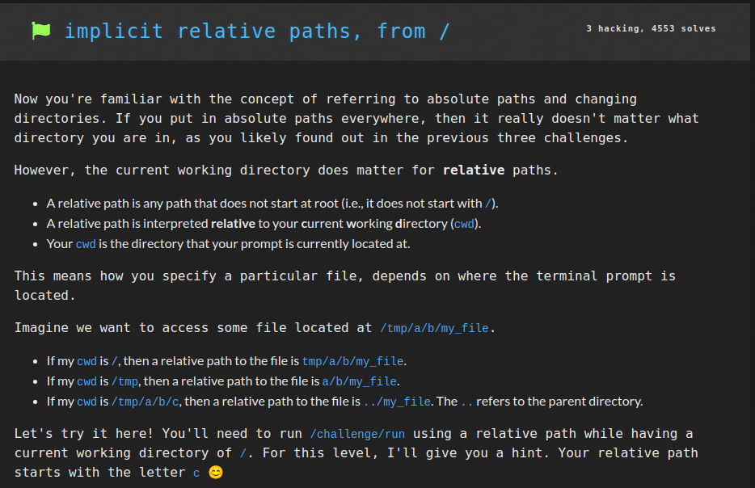

# Linux Luminarium: Pondering Paths

This write-up covers the solutions for the "Pondering Paths" module in pwn.college, detailing the thought process and step-by-step solution for each problem.

---

## Challenge 1: The Root

### Problem Description
A challenge to get the flag by invoking the `pwn` program located in the `root` using its absolute path.

### Approach
1. I connected to the SSH using the command `ssh -i key hacker@pwn.college`.
2. I entered the command `/pwn` to invoke the `pwn` program located in the `root` and the flag was returned.

### Flag
`pwn.college{8XEff0tJkeJZRpSZYtac52h6sL3.dhzN5QDLyITO0czW}`

## Challenge 2: Program and Absolute Paths

### Problem Description
A challenge to get the flag by executing the `run` file in the `challenge` directory which is in the `root` directory.

### Approach
1. I connected to the SSH using the command `ssh -i key hacker@pwn.college`.
2. I entered the command `/challenge/run` to invoke the `run` program inside the `/challenge` directory and the flag was returned.

### Flag
`pwn.college{AWmsLEXfaJmc_Bn0qbHtONUe8gH.dVDN1QDLyITO0czW}`

## Challenge 3: Position thy self

### Problem Description
A challenge to get the flag by executing the `/challenge/run` file from a particular directory through absolute path.

### Approach
1. I connected to the SSH using the command `ssh -i key hacker@pwn.college`.
2. I entered the command `/challenge/run` to invoke the `run` program inside the `/challenge` directory. This returned an error and I was informed that I am supposed to be in the `/etc/apt/sources.list.d` directory.
3. I used the command `cd /etc/apt/sources.list.d` to change directory.
4. Now running the command `/challenge/run` from this directory gave me the flag.

### Flag
`pwn.college{ooqSCcWk3ak9VWYIRt1pQXww-CF.dZDN1QDLyITO0czW}`

## Challenge 4: Position Elsewhere

### Problem Description
A challenge to get the flag by executing the `/challenge/run` file from a particular directory through absolute path.

### Approach
1. I connected to the SSH using the command `ssh -i key hacker@pwn.college`.
2. I entered the command `/challenge/run` to invoke the `run` program inside the `/challenge` directory. This returned an error and I was informed that I am supposed to be in the `root` directory.
3. I used the command `cd /` to change directory.
4. Now running the command `/challenge/run` from this directory gave me the flag.

### Flag
`pwn.college{UJlJYhydwu-xwrjFbA8FVm4zwSO.ddDN1QDLyITO0czW}`

## Challenge 5: Position yet Elsewhere

### Problem Description
A challenge to get the flag by executing the `/challenge/run` file from a particular directory through absolute path.

### Approach
1. I connected to the SSH using the command `ssh -i key hacker@pwn.college`.
2. I entered the command `/challenge/run` to invoke the `run` program inside the `/challenge` directory. This returned an error and I was informed that I am supposed to be in the `/var` directory.
3. I used the command `cd /var` to change directory.
4. Now running the command `/challenge/run` from this directory gave me the flag.

### Flag
`pwn.college{Y6CZtQs9N9uGsPLOxkHE540NAyO.dhDN1QDLyITO0czW}`

## Challenge 6: Implicit relative paths, from /

### Problem Description
A challenge to get the flag by executing the `/challenge/run` file from `Root` directory through relative path (implicitly).

### Approach
1. I connected to the SSH using the command `ssh -i key hacker@pwn.college`.
2. I used the command `cd /` to change directory to `root`.
3. Now running the command `challenge/run` from this directory gave me the flag.

### Flag
`pwn.college{YRG0H7uRSO_mOt5i-PD4t9DfqJd.dlDN1QDLyITO0czW}`

## Challenge 7: Explicit relative paths, from /

### Problem Description
A challenge to get the flag by executing the `/challenge/run` file from `Root` directory through relative path (explicitly).

### Approach
1. I connected to the SSH using the command `ssh -i key hacker@pwn.college`.
2. I used the command `cd /` to change directory to `root`.
3. Now running the command `./challenge/run` from this directory gave me the flag.

### Flag
`pwn.college{AQUKQJswJk10ZTVrZuI-W0kqcnR.dBTN1QDLyITO0czW}`

## Challenge 8: Implicit relative path

### Problem Description
A challenge to get the flag by executing the `/challenge/run` file from `/challenge` directory through relative path.

### Approach
1. I connected to the SSH using the command `ssh -i key hacker@pwn.college`.
2. I used the command `cd /challenge` to change directory.
3. Now running the command `./run` from this directory gave me the flag. 

    #### Note:
    Entering the command `run` returns `run: command not found` and hence explicit path must be used.

### Flag
`pwn.college{sL5TUchGA_5V4aESfECf8GOCqPw.dFTN1QDLyITO0czW}`

## Challenge 9: Home Sweet Home

### Problem Description
A challenge to get the flag by executing the `/challenge/run` file with an argument with constraints:
1. The argument must be an absolute path,
2. The path must be inside the home directory, and
3. the argument must be three characters or less.

### Approach
1. I connected to the SSH using the command `ssh -i key hacker@pwn.college`.
2. I entered the command `/challenge/run ~/a` from this directory. Here `~/a` was provided as the argument and refers to the absolute path to the file i.e. `/home/hacker/a` and hence this command gave me the flag.

### Flag
`pwn.college{gqcqdCI8UJMFAZOH8zpmVOUHrCD.dNzM4QDLyITO0czW}`