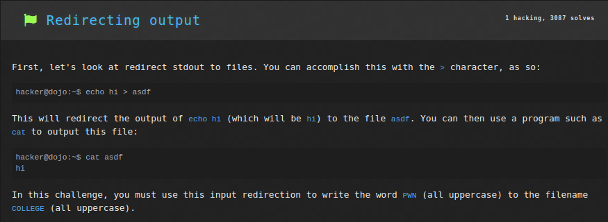
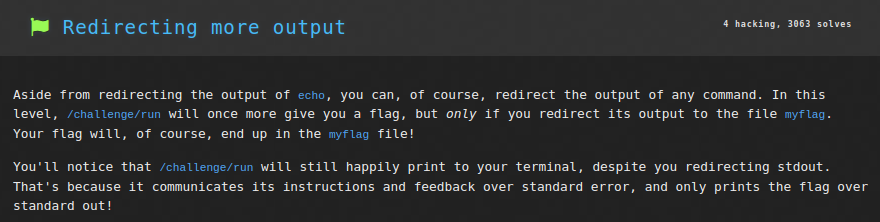
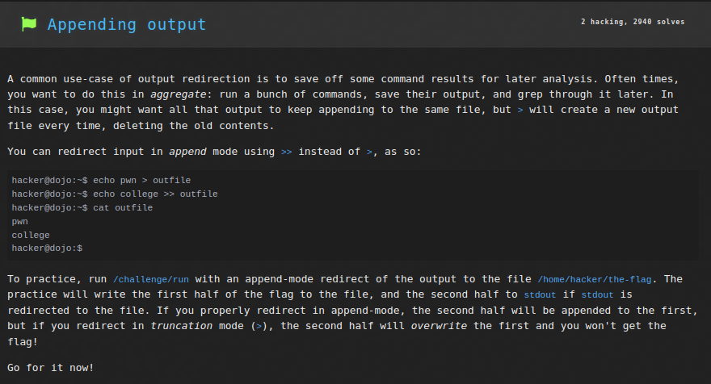
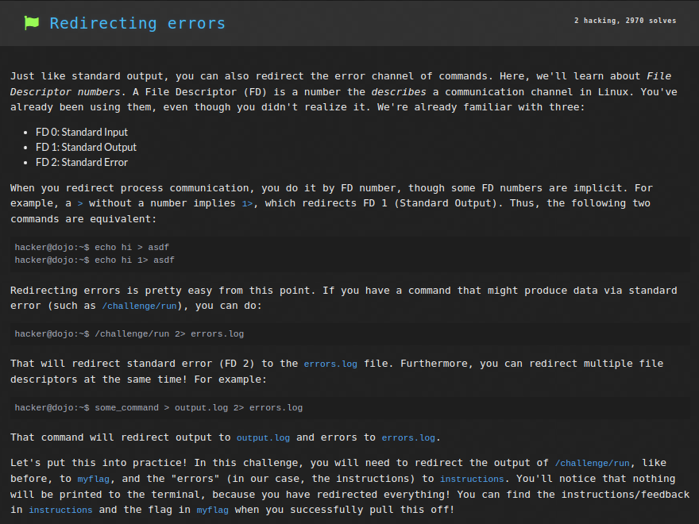
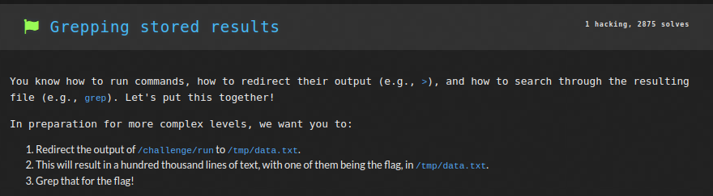
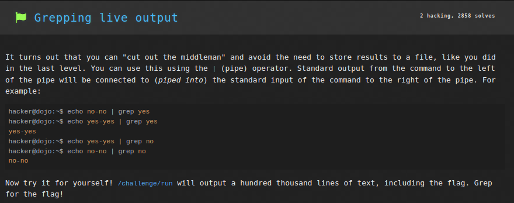
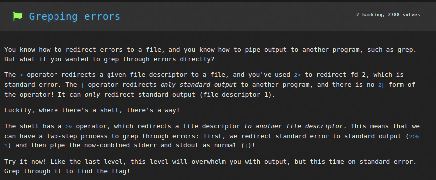
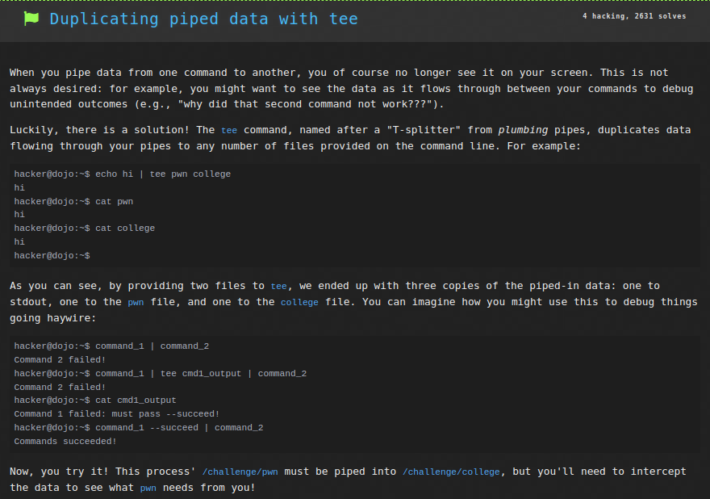
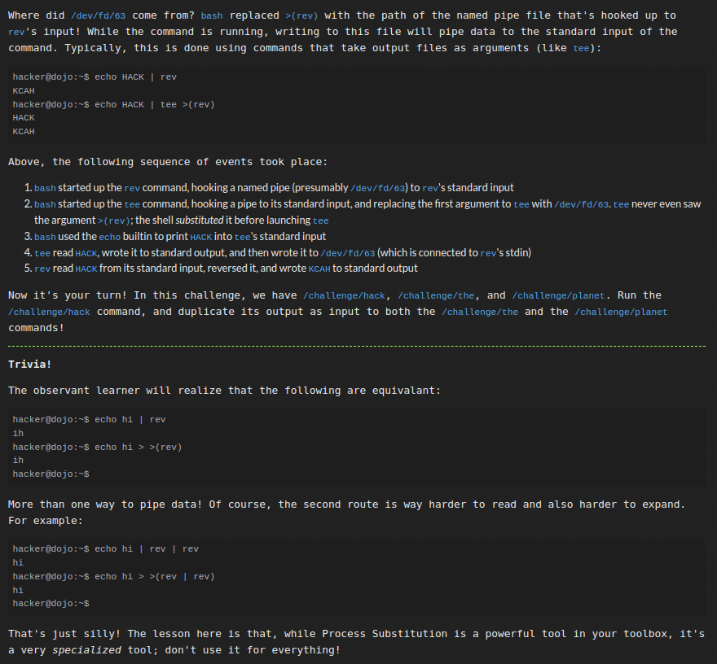
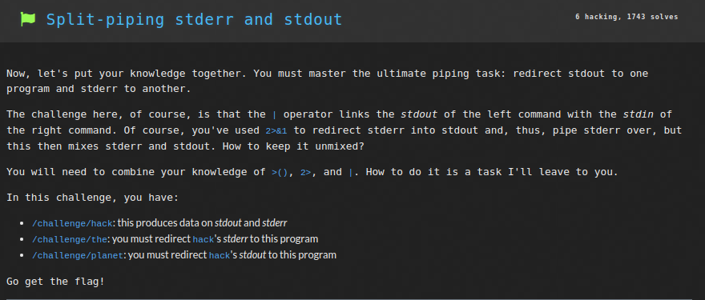

# Linux Luminarium: Practicing Piping

This write-up covers the solutions for the "Practicing Piping" module in pwn.college, detailing the thought process and step-by-step solution for each problem.

---

## Challenge 1: Redirecting output

### Problem Description
A challenge to get the flag by writing the word `PWN` to the file `~/COLLEGE`

### Approach
1. I connected to the SSH using the command `ssh -i key hacker@pwn.college`.
2. I entered the command `echo PWN > COLLEGE` to redirect `stdout` from `echo` into the file `~/COLLEGE`, thus writing `PWN` inside it. Hence the flag was returned.

### Flag
`pwn.college{U-yll4EAPpqZLdsVXSL97rRxZEO.dRjN1QDLyITO0czW}`

## Challenge 2: Redirecting more output

### Problem Description
A challenge to get the flag by writing the output of the program `/challenge/run` to the file `~/myflag`.

### Approach
1. I connected to the SSH using the command `ssh -i key hacker@pwn.college`.
2. I entered the command `/challenge/run > myflag` to redirect `stdout` from `/challenge/run` into the file `~/myflag`, thus writing the flag inside it.
3. Now the command `cat myflag` printed the flag.

### Flag
`pwn.college{MHYto2ev-REzS61KsSB8p_RN67Q.dVjN1QDLyITO0czW}`

## Challenge 3: Appending output

### Problem Description
A challenge to get the flag by appending the output of the program `/challenge/run` to the file `~/the-flag` without overwriting it.

### Approach
1. I connected to the SSH using the command `ssh -i key hacker@pwn.college`.
2. I entered the command `/challenge/run >> the-flag` to redirect `stdout` from `/challenge/run` into the file `~/the-flag`, thus writing the second half of the flag inside it.
3. Now the command `cat the-flag` printed the flag.

### Flag
`pwn.college{cbdXFmQIdAIDKVQWoqra0XgwUwp.ddDM5QDLyITO0czW}`

## Challenge 4: Redirecting errors

### Problem Description
A challenge to get the flag by writing the standard output of the program `/challenge/run` to the file `~/myflag` and the standard error to the file `~/instructions`.

### Approach
1. I connected to the SSH using the command `ssh -i key hacker@pwn.college`.
2. I entered the command `/challenge/run > myflag 2>instructions` to redirect `stdout` from `/challenge/run` into the file `~/myflag`, and the standard error (FD2) into the file `~/instructions`.
3. Now the command `cat myflag` printed the flag.

### Flag
`pwn.college{w3ema_gnJrE0hpBfCYojrohRimU.ddjN1QDLyITO0czW}`

## Challenge 5: Redirecting input

### Problem Description
A challenge to get the flag by giving the contents of the file `PWN` as input to `/challenge/run`.

### Approach
1. I connected to the SSH using the command `ssh -i key hacker@pwn.college`.
2. I entered the command `echo COLLEGE > PWN` to redirect `stdout` from `echo COLLEGE` into the file `PWN`, thus writing inside the file.
3. Now with the command `/challenge/run < PWN`, the program `/challenge/run` received the contents of `PWN` as input and hence returned the flag.

### Flag
`pwn.college{QUgsMQUyJDTgGjiZy4u1eN-R5Xw.dBzN1QDLyITO0czW}`

## Challenge 6: grepping stored results

### Problem Description
A challenge to get the flag by storing the output of `/challenge/run` in a file and then grepping it to get the flag.

### Approach
1. I connected to the SSH using the command `ssh -i key hacker@pwn.college`.
2. I entered the command `/challenge/run > /tmp/data.txt` to redirect `stdout` from `/challenge/run` into the file `/tmp/data.txt`, thus writing the flag inside the file.
3. Now the command `grep "pwn.college" /tmp/data.txt` searched for the string `pwn.college` inside `data.txt` and hence returned the flag.

### Flag
`pwn.college{AI5R79HrHhiwOAmGPoIVGZj1_Om.dhTM4QDLyITO0czW}`

## Challenge 7: Grepping live output

### Problem Description
A challenge to get the flag by directly grepping the output of `/challenge/run` to get the flag without storing it in any file.

### Approach
1. I connected to the SSH using the command `ssh -i key hacker@pwn.college`.
2. Now the command `/challenge/run | grep "pwn.college"` searched for the string `pwn.college` inside the `stdout` of `/challenge/run` directly and hence returned the flag.

### Flag
`pwn.college{IYSdy1Smmz1Vkvpafrinv4ePLt_.dlTM4QDLyITO0czW}`

## Challenge 8: Grepping errors

### Problem Description
A challenge to get the flag by directly grepping the `stderr` of `/challenge/run` to get the flag.

### Approach
1. I connected to the SSH using the command `ssh -i key hacker@pwn.college`.
2. Now the command `/challenge/run 2>&1 | grep "pwn.college"` first redirected `stderr` into `stdout` of the `/challenge/run` program and then searched for the string `pwn.college` inside the `stdout` of `/challenge/run` directly, hence printing the flag.

### Flag
`pwn.college{My1ss-BAvxR9IE8Hp1kIz68C1yl.dVDM5QDLyITO0czW}`

## Challenge 9: Duplicating piped data with tee

### Problem Description
A challenge to get the flag by passing output of `/challenge/pwn` into `/challenge/college`, while also duplicating it to get instructions to get the flag.

### Approach
1. I connected to the SSH using the command `ssh -i key hacker@pwn.college`.
2. Now the command `/challenge/pwn | tee out | /challenge/college` first redirected `stdout` of the `/challenge/pwn` program to the file `out` as well as to `stdout` which then was piped into `/challenge/college`. This gave an error since there was some instruction left unfollowed.
3. Now `cat out` printed the output of `/challenge/pwn` where it mentioned that an argument `--secret 08CtGkE2` must be provided to `/challenge/pwn`.
4. Thus the command `/challenge/pwn --secret 08CtGkE2 | /challenge/college` returns the flag.

### Flag
`pwn.college{08CtGkE2WLOOPd6Y518HMDB_Kqs.dFjM5QDLyITO0czW}`

## Challenge 10: Writing to multiple programs

### Problem Description
A challenge to get the flag by passing output of `/challenge/hack` program into both `/challenge/the` and `/challenge/planet`.

### Approach
1. I connected to the SSH using the command `ssh -i key hacker@pwn.college`.
2. Now the command `/challenge/hack | tee >( /challenge/the ) | /challenge/planet` first redirected `stdout` of the `/challenge/hack` program to the named pipe `>(/challenge/the)`  as well as to `stdout` which then was piped into `/challenge/planet`. Hence both programs got input as `stdout` of `/challenge/hack` and the flag was returned.

### Flag
`pwn.college{ojSpVgE6DeHgTzt3T6_UccJVRvo.dBDO0UDLyITO0czW}`

## Challenge 11: Split-piping stderr and stdout

### Problem Description
A challenge to get the flag by passing output of `/challenge/hack` into `/challenge/planet`, while also passing the standard error into `/challenge/the`.

### Approach
1. I connected to the SSH using the command `ssh -i key hacker@pwn.college`.
2. Now the command `/challenge/hack 2> >(/challenge/the) 1> >(/challenge/planet)` redirected `stderr` (FD2) of the `/challenge/hack` program to the named pipe `>(/challenge/the)`  and its `stdout` (FD1) to the named pipe `>(/challenge/planet)`. Hence both programs got input as `stdout` of `/challenge/hack` and the flag was returned.

### Flag
`pwn.college{gSldNS8Guy8q0v6Vb2ocSNHA6HS.dFDNwYDLyITO0czW}`