# Linux Luminarium: Processes and Jobs

This write-up covers the solutions for the "Processes and Jobs" module in pwn.college, detailing the thought process and step-by-step solution for each problem.

---

## Challenge 1: Listing Processes

### Problem Description
A challenge to get the flag by listing all running processes, to find the program in `/challenge` which returns the flag.

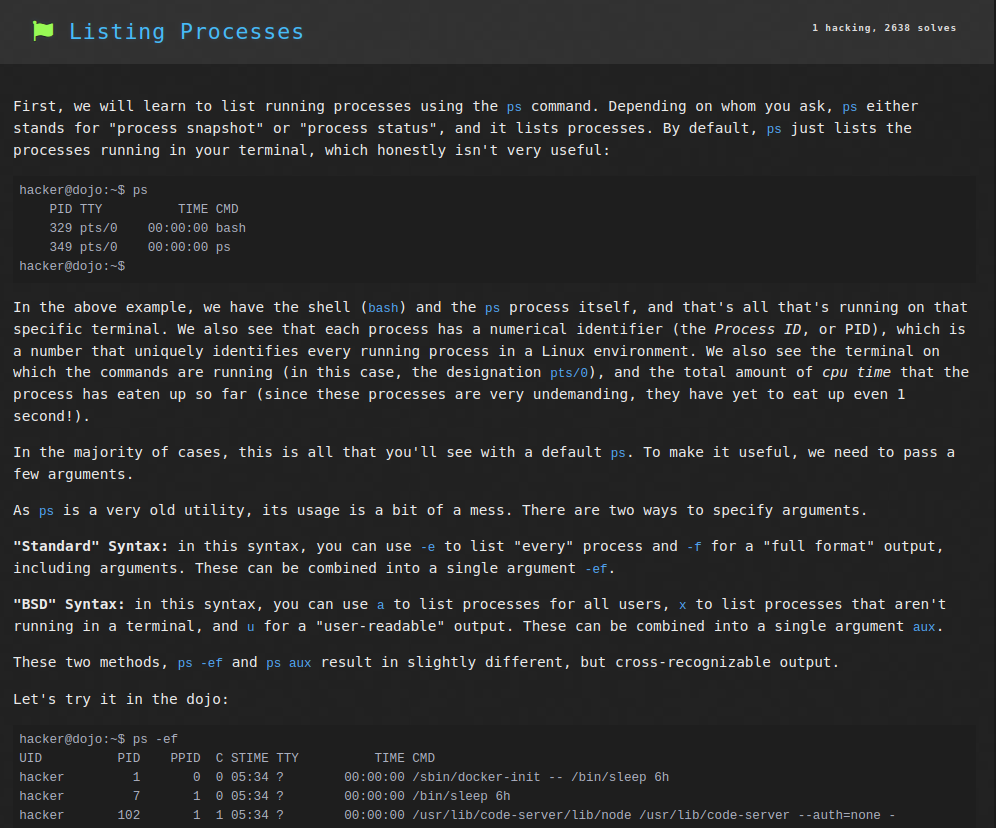
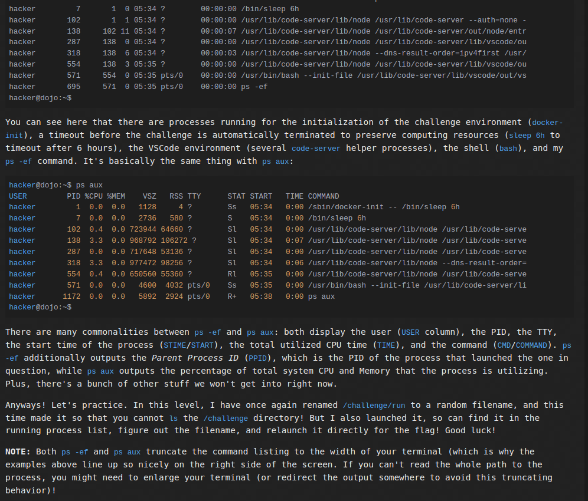

### Approach
1. I connected to the SSH using the command `ssh -i key hacker@pwn.college`.
2. I entered the command `ps aux` to get all running processes, one of which was `/challenge/10307-run-1147`.
3. Now running the program through the command `/challenge/10307-run-1147` returns the flag.

### Flag
`pwn.college{IB4WaTa6dWlbNhf1KUofZFwofvl.dhzM4QDLyITO0czW}`

## Challenge 2: Killing Processes

### Problem Description
A challenge to get the flag by kiling the running process `/challenge/dont_run` and then running `/challenge/run`.

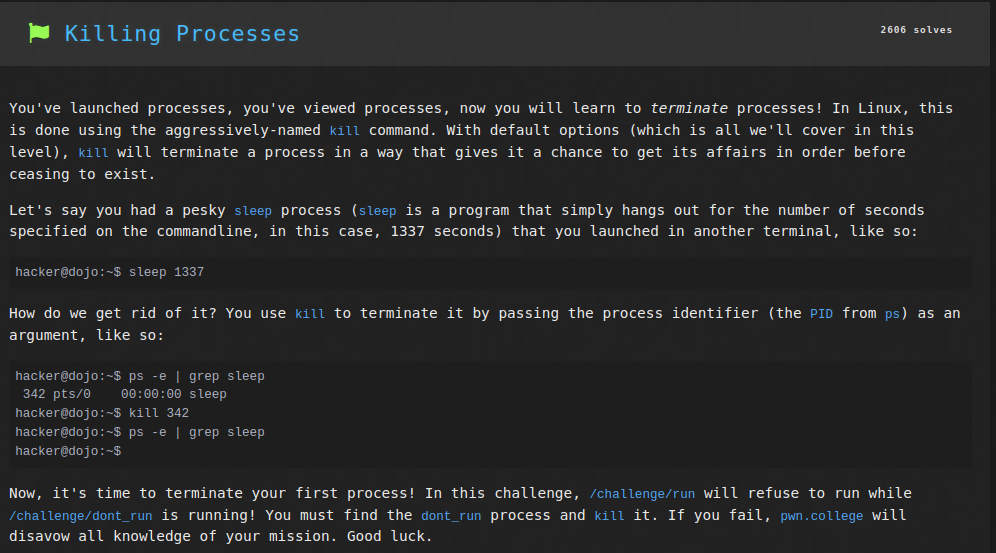

### Approach
1. I connected to the SSH using the command `ssh -i key hacker@pwn.college`.
2. I entered the command `ps aux` to get all running processes, one of which was `/challenge/dont_run` with Process ID (PID) `73`.
3. Then I ran the command `kill 73` to kill the above process.
4. Now running the program through the command `/challenge/run` returns the flag.

### Flag
`pwn.college{krVDoONlUohAtsmtm53mRxkYnr2.dJDN4QDLyITO0czW}`

## Challenge 3: Interrupting Processes

### Problem Description
A challenge to get the flag by running the program `/challenge/run` and then interrupting the process.

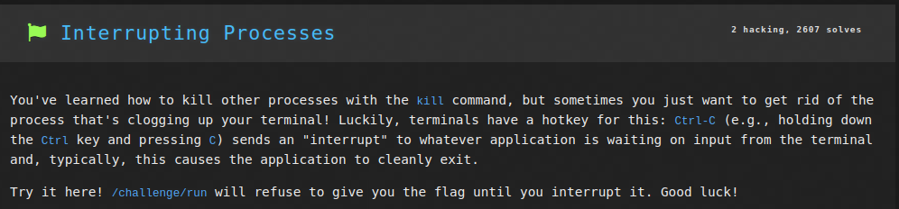

### Approach
1. I connected to the SSH using the command `ssh -i key hacker@pwn.college`.
2. I entered the command `/challenge/run` to run the program.
3. Then pressing `CTRL + C`, hence interrupting the program printed the flag.

### Flag
`pwn.college{kmgjipPWHOkSo6vVI4NLHnY_aMW.dNDN4QDLyITO0czW}`

## Challenge 4: Suspending Processes

### Problem Description
A challenge to get the flag by running and then suspending the program `/challenge/run`, and then running another copy of the program.

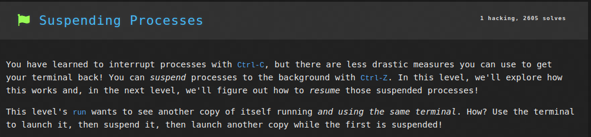

### Approach
1. I connected to the SSH using the command `ssh -i key hacker@pwn.college`.
2. I entered the command `/challenge/run` to run the program.
3. Then the shortcut `CTRL + Z`, suspended the program.
4. Now running `/challenge/run` again returned the flag as there were 2 instances of it.

### Flag
`pwn.college{AEmBwmfPwEevxlkstTZMk8FcIr4.dVDN4QDLyITO0czW}`

## Challenge 5: Resuming Processes

### Problem Description
A challenge to get the flag by running and then suspending the program `/challenge/run`, and then resuming it.

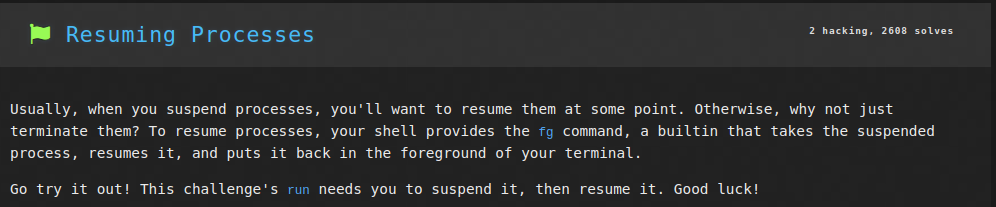

### Approach
1. I connected to the SSH using the command `ssh -i key hacker@pwn.college`.
2. I entered the command `/challenge/run` to run the program.
3. Then the shortcut `CTRL + Z`, suspended the program.
4. Now running the command `fg` returned the flag as the program was resumed.

### Flag
`pwn.college{82etgdq-HzeuvWP2c9EpiBFzDJJ.dZDN4QDLyITO0czW}`

## Challenge 6: Backgrounding Processes

### Problem Description
A challenge to get the flag by running the program `/challenge/run` in the background, and then running another copy of the program in the foreground.

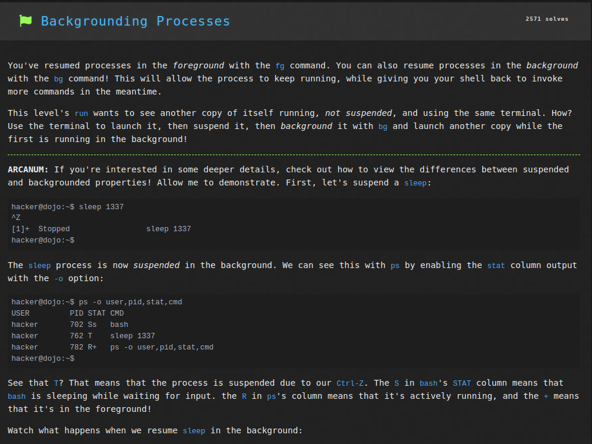
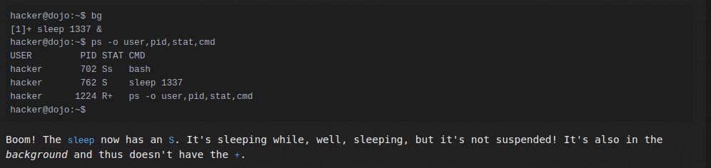

### Approach
1. I connected to the SSH using the command `ssh -i key hacker@pwn.college`.
2. I entered the command `/challenge/run` to run the program.
3. Then the shortcut `CTRL + Z`, suspended the program.
4. Now running the command `bg` resumed `/challenge/run` in the background.
5. Now running `/challenge/run` again returned the flag as there were 2 instances of it.

### Flag
`pwn.college{QAd6Ygl-ktafIPiAUduZ66I6kMd.ddDN4QDLyITO0czW}`

## Challenge 7: Foregrounding Processes

### Problem Description
A challenge to get the flag by running the program `/challenge/run` in the background, and then running the same program in the foreground.

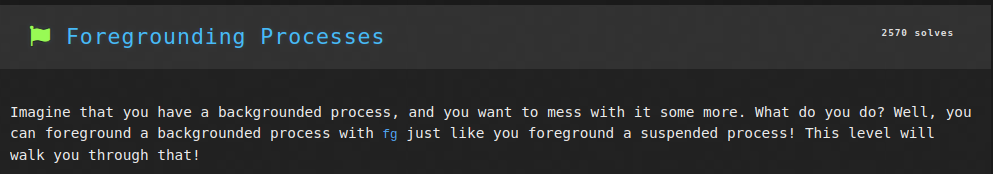

### Approach
1. I connected to the SSH using the command `ssh -i key hacker@pwn.college`.
2. I entered the command `/challenge/run` to run the program.
3. Then the shortcut `CTRL + Z`, suspended the program.
4. Now running the command `bg` caused `/challenge/run` to run in the background.
5. Now running `fg` and then pressing `ENTER` returned the flag as it foregrounded the background process `/challenge/run`.

### Flag
`pwn.college{YBYvLfLfqeM259_FNoIgMWbBsHI.dhDN4QDLyITO0czW}`

## Challenge 8: Starting Backgrounded Processes

### Problem Description
A challenge to get the flag by running the program `/challenge/run` in the background.

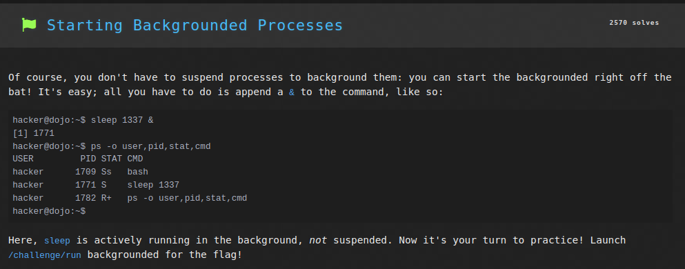

### Approach
1. I connected to the SSH using the command `ssh -i key hacker@pwn.college`.
2. I entered the command `/challenge/run &` to run the program in the background.

### Flag
`pwn.college{UMuCafKqBnk429_TfeH9ZCmc0vy.dlDN4QDLyITO0czW}`

## Challenge 9: Process Exit Codes

### Problem Description
A challenge to get the flag by running the program `/challenge/get-code` and using its exit code as an argument to `/challenge/submit-code`.

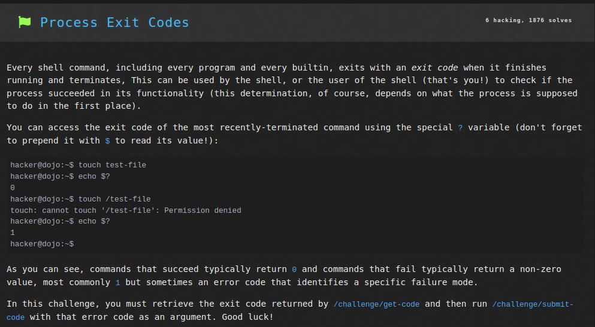

### Approach
1. I connected to the SSH using the command `ssh -i key hacker@pwn.college`.
2. I entered the command `/challenge/get` to run the program.
3. I then ran `echo $?` to get the value of the variable `?` which holds the exit code of the last process. This returned a value of `63`
4. Now the command `/challenge/submit-code 63` returns the flag.

### Flag
`pwn.college{wVeIeANiNlGdQ325yKmwHvNRb26.dljN4UDLyITO0czW}`