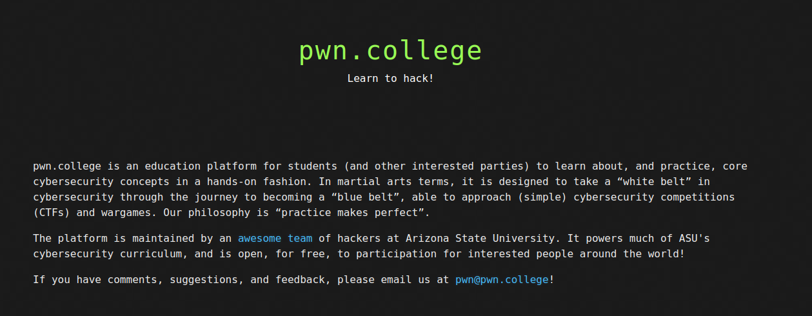

# pwn.college solutions

This repository contains my solutions to the challenges in various dojos in [pwn.college](https://pwn.college). Each solution includes a detailed write-up of my thought process, methodologies, and code/commands used to achieve the objectives.

---

## Introduction



The pwn.college website presents various challenges focused on essential cybersecurity concepts. This repository documents my solutions, showcasing the strategies and tools used to tackle each challenge effectively.

---

## Dojos

### Linux Luminarium
1. [Hello Hackers](Hello_Hackers.md)
2. [Pondering Paths](Pondering_Paths.md)
3. [Comprehending Commands](Comprehending_Commands.md)
4. [Digesting Documentation](Digesting_Documentation.md)
5. [File Globbing](File_Globbing.md)
6. [Practicing Piping](Practicing_Piping.md)
7. [Shell Variables](Shell_Variables.md)
8. [Processes and Jobs](Processes_and_Jobs.md)
9. [Perceiving Permissions](Perceiving_Permissions.md)
10. [Untangling Users](Untangling_Users.md)
11. [Chaining Commands](Chaining_Commands.md)
12. [Pondering PATH](Pondering_PATH.md)

## Setup

### Linux Setup

#### Windows

To set up a Linux environment on Windows, follow these steps:

1. **Download Windows Subsystem for Linux (WSL)**:  
   This is a virtual installation of Linux built on top of Windows. Installing the **Ubuntu 22.04** version is recommended, as it generally works smoothly and is very stable.  
   **Link**: [Download Ubuntu 22.04 WSL](https://apps.microsoft.com/detail/9pn20msr04dw)

2. Once downloaded and installed, click on the orange Ubuntu icon that appears in your apps menu. This will open Ubuntu Linux directly and take you into a terminal.

> **Note**: While WSL is recommended for beginners, you can also use VMware to run your own Linux virtual machine if you prefer.

---

#### MacOS

You don’t need to install any additional environment, as macOS already has SSH working. It is generally close enough to GNU/Linux to avoid any significant issues.

---

### SSH Setup

To set up SSH on WSL, follow these steps:

1. Run the following command to generate your SSH key:
   ```bash
   ssh-keygen -f key -N ''
   ```
2. Two files should have been created, `key` and `key.pub`. Copy the contents of `key.pub`.

### Using SSH with pwn.college

1. Make an account on pwn.college.
2. Go to the `Settings` tab, then go to `SSH key > Current SSH key` and paste the contents of `key.pub`.
3. SSH can now be used with pwn.college. To connect to a dojo over SSH, use the following command:
    ```bash
    ssh -i key hacker@pwn.college
    ```
