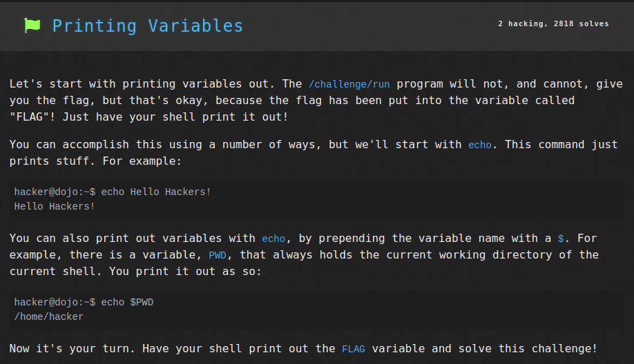
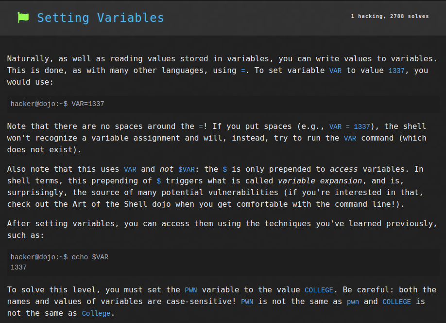
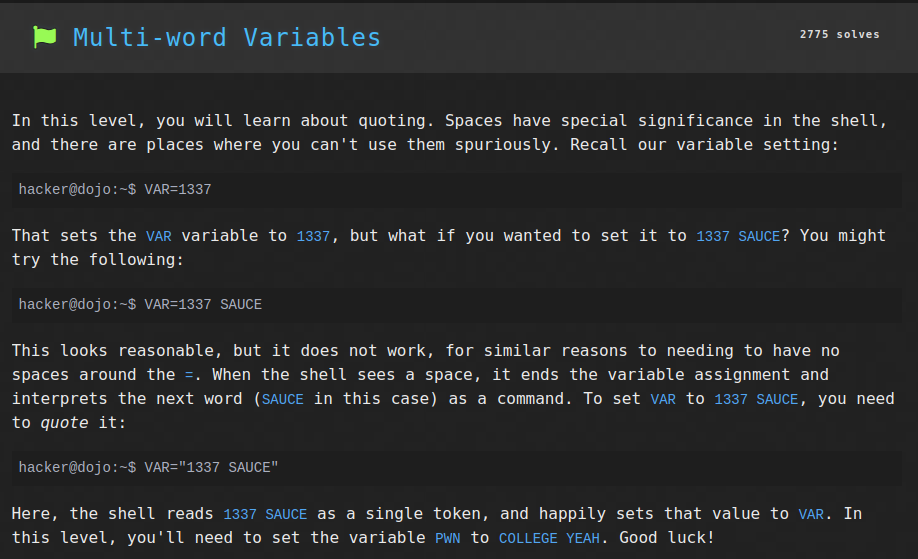
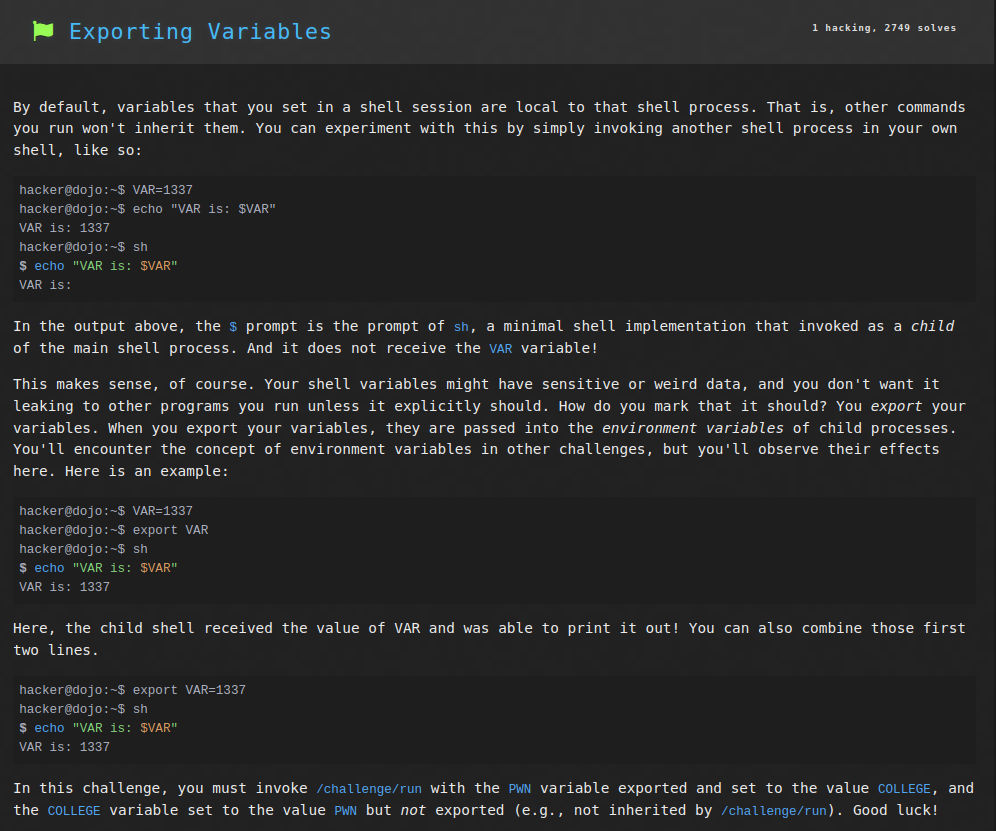
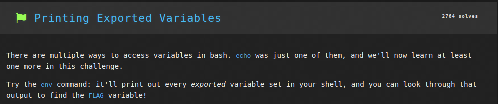
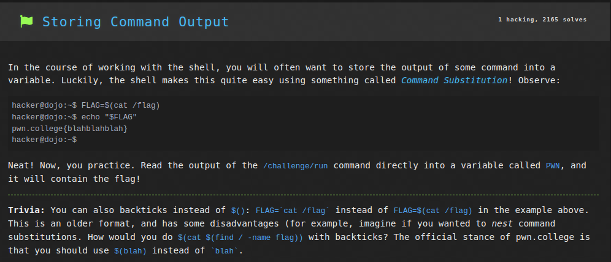
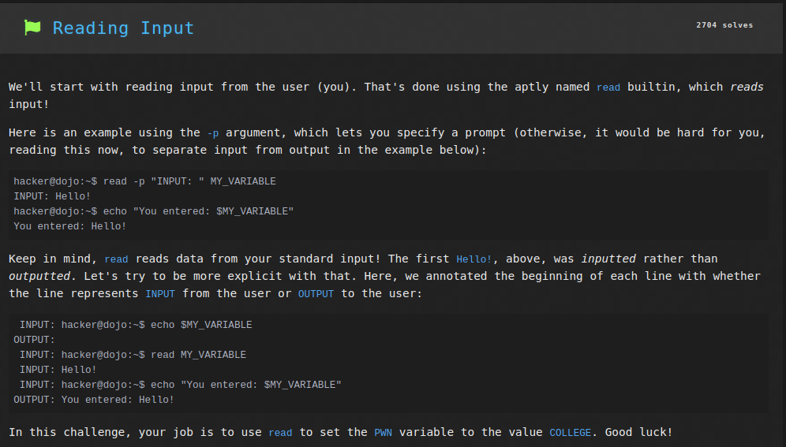
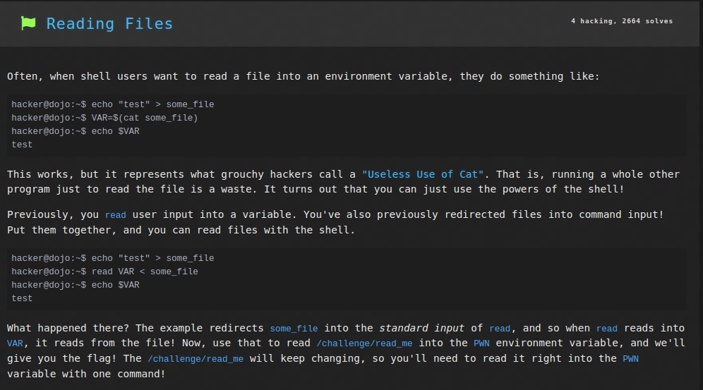

# Linux Luminarium: Shell Variables

This write-up covers the solutions for the "Shell Variables" module in pwn.college, detailing the thought process and step-by-step solution for each problem.

---

## Challenge 1: Printing Variables

### Problem Description
A challenge to get the flag by printing the value of the `FLAG` variable.

### Approach
1. I connected to the SSH using the command `ssh -i key hacker@pwn.college`.
2. I entered the command `echo $FLAG` to invoke the `echo` command to print out the value of the `FLAG` variable.

### Flag
`pwn.college{k36KRTMQrRrlDzCYOk68m1UACky.ddTN1QDLyITO0czW}`

## Challenge 2: Setting Variables

### Problem Description
A challenge to get the flag by setting the value of the variable `PWN` to `COLLEGE`.

### Approach
1. I connected to the SSH using the command `ssh -i key hacker@pwn.college`.
2. I entered the command `PWN=COLLEGE` to set the value of the variable `PWN` to `COLLEGE`.

### Flag
`pwn.college{Y1Jra_InWhqc1jx2AKzrZRi9W5-.dlTN1QDLyITO0czW}`

## Challenge 3: Multi-word Variables

### Problem Description
A challenge to get the flag by setting the value of the variable `PWN` to `COLLEGE YEAH`.

### Approach
1. I connected to the SSH using the command `ssh -i key hacker@pwn.college`.
2. I entered the command `PWN="COLLEGE YEAH"` to set the value of the variable `PWN` to `COLLEGE YEAH`. Double-quotation marks ("") must be used so that the word `YEAH` is interpreted as part of the string value, not a command.

### Flag
`pwn.college{0sFrlelHcMJS0w15i3b27rEabFy.dBjN1QDLyITO0czW}`

## Challenge 4: Exporting Variables

### Problem Description
A challenge to get the flag by setting the value of the variable `PWN` to `COLLEGE` and exporting it, and then setting value of variable `COLLEGE` to `PWN`.

### Approach
1. I connected to the SSH using the command `ssh -i key hacker@pwn.college`.
2. I entered the command `export PWN=COLLEGE` to set and export the value of the variable `PWN` to `COLLEGE`.
3. Then I ran the command `COLLEGE=PWN` to set the value of the variable `COLLEGE` to `PWN`.

### Flag
`pwn.college{gcuazlfiT1AF7AXMw9OYt2ttZx-.dJjN1QDLyITO0czW}`

## Challenge 5: Printing Exported Variables

### Problem Description
A challenge to get the flag by listing all environment variables and finding the flag inside it.

### Approach
1. I connected to the SSH using the command `ssh -i key hacker@pwn.college`.
2. I entered the command `env | grep pwn.college`. The command `env` lists all environment variables to `stdout` which i then piped out and grepped to get the flag variable's value `FLAG=pwn.college{0sq8EIounWQ4hEKe2cPWgFcztaP.dhTN1QDLyITO0czW}`.

### Flag
`pwn.college{0sq8EIounWQ4hEKe2cPWgFcztaP.dhTN1QDLyITO0czW}`

## Challenge 6: Storing Command Output

### Problem Description
A challenge to get the flag by running `/challenge/run` and storing its output in the variable `PWN`, then printing out its value.

### Approach
1. I connected to the SSH using the command `ssh -i key hacker@pwn.college`.
2. I entered the command `PWN = $(/challenge/run)` to save the output of the `/challenge/run` program to the `PWN` variable.
3. Then the command `echo $PWN` prints out the flag.

### Flag
`pwn.college{oS1PSOqKnaYpUFKNbrYxpIjD3Nq.dVzN0UDLyITO0czW}`

## Challenge 7: Reading Input

### Problem Description
A challenge to get the flag by setting the value of the variable `PWN` to the value `COLLEGE` through user input.

### Approach
1. I connected to the SSH using the command `ssh -i key hacker@pwn.college`.
2. I entered the command `read PWN` to set the variable `PWN` to input entered by the user.
3. Then I entered `COLLEGE` into the input which prints out the flag.

### Flag
`pwn.college{sBIMjt5BUeLKjYQqXwkxzwY4JQK.dhzN1QDLyITO0czW}`

## Challenge 8: Reading Files

### Problem Description
A challenge to get the flag by setting the value of the variable `PWN` to the contents of the file `/challenge/read_me` by input redirection.

### Approach
1. I connected to the SSH using the command `ssh -i key hacker@pwn.college`.
2. I entered the command `read PWN < /challenge/read_me` to set the variable `PWN` to the value inside the file `/challenge/read_me` through `stdin` redirection.

### Flag
`pwn.college{8x0Odh9MHaoO3KDD1J_QnFspl0M.dBjM4QDLyITO0czW}`