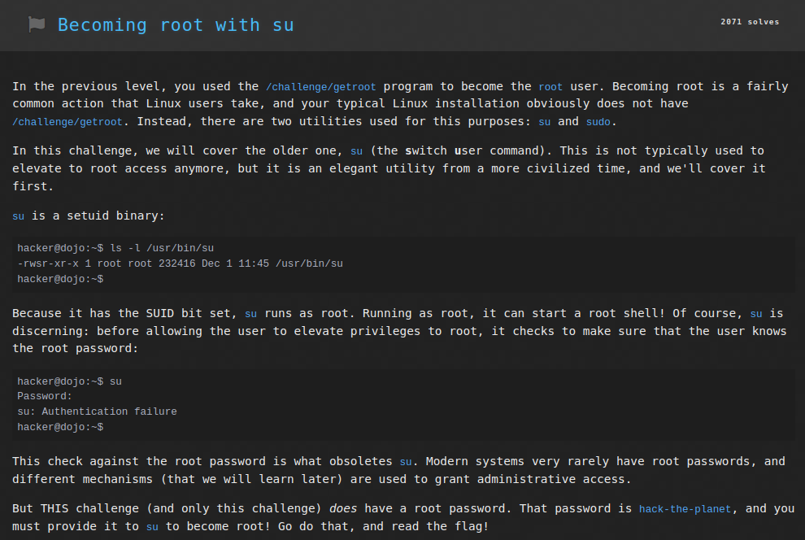
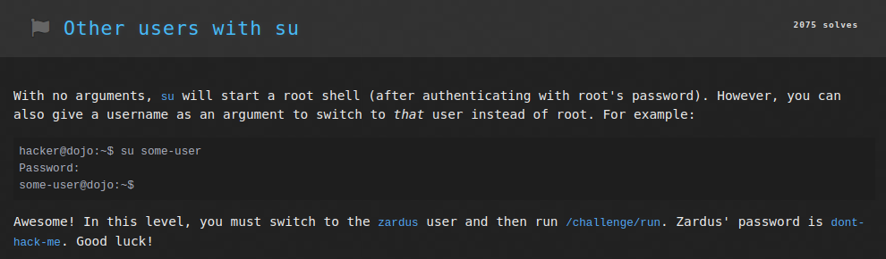
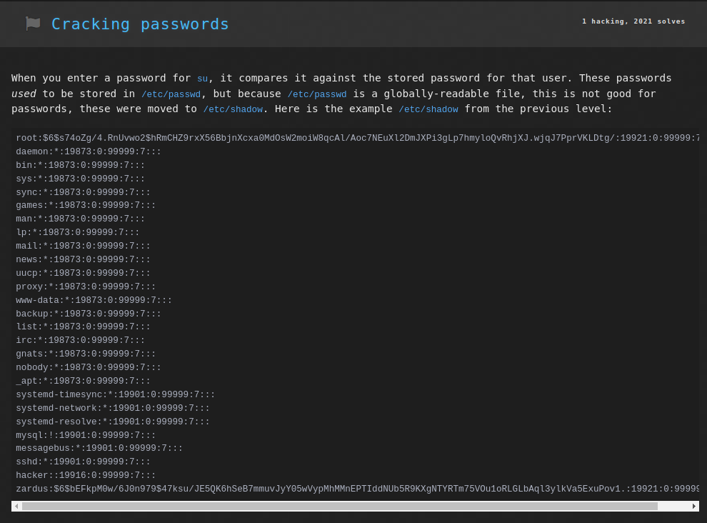
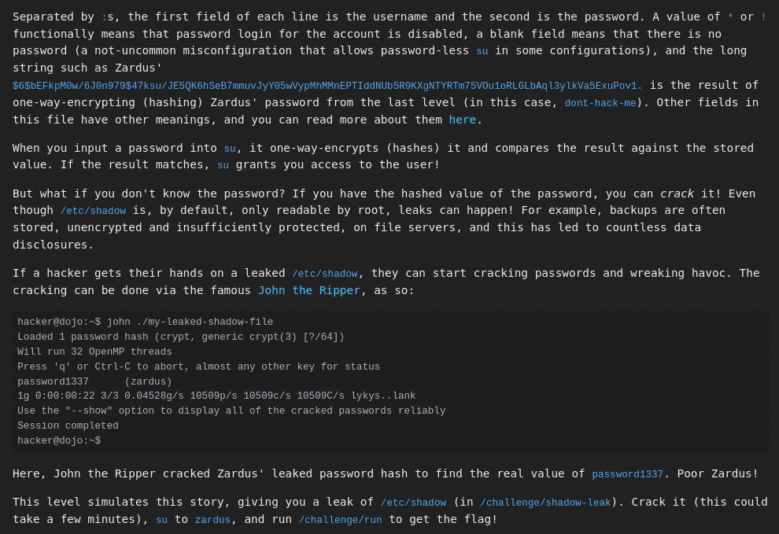
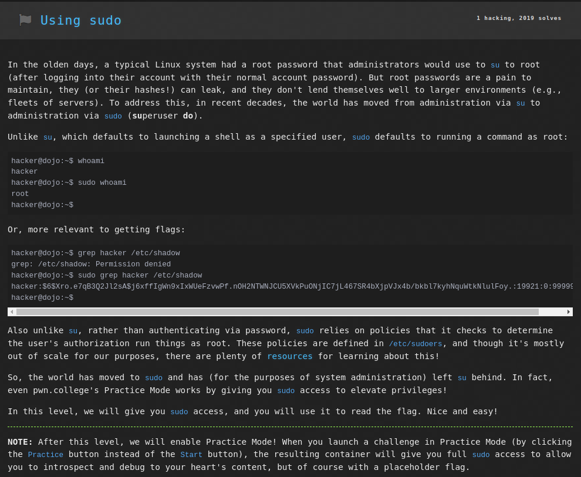

# Linux Luminarium: Untangling Users

This write-up covers the solutions for the "Untangling Users" module in pwn.college, detailing the thought process and step-by-step solution for each problem.

---

## Challenge 1: Becoming root with su

### Problem Description
A challenge to get the flag by accessing the file `/flag` as `root` user and hence reading it.

### Approach
1. I connected to the SSH using the command `ssh -i key hacker@pwn.college`.
2. I entered the command `su` and then when prompted entered the password `hack-the-planet` to switch to the `root` user.
3. Now running the program through the command `cat /flag` returns the flag.

### Flag
`pwn.college{4edkQUqXy7IuuV6RhsSsaeQEAbF.dVTN0UDLyITO0czW}`

## Challenge 2: Other users with su

### Problem Description
A challenge to get the flag by running the program `/challenge/run` as `zardus` user.

### Approach
1. I connected to the SSH using the command `ssh -i key hacker@pwn.college`.
2. I entered the command `su zardus` and then when prompted entered the password `dont-hack-me` to switch to the `zardus` user.
3. Now running the program through the command `/challenge/run` returns the flag.

### Flag
`pwn.college{wTZRaBH_fki2Sj90sAAM5Hc7sE5.dZTN0UDLyITO0czW}`

## Challenge 3: Cracking Passwords

### Problem Description
A challenge to get the flag by running the program `/challenge/run` as `zardus` user by cracking its password first.

### Approach
1. I connected to the SSH using the command `ssh -i key hacker@pwn.college`.
2. I entered the command `john /challenge/shadow-leak` to use `John the Ripper` tool to crack the hashed password for user `zardus` in the file.
3. After the cracking was completed, the command `john /challenge/shadow-leak --show` displayed all known user passwords, one of which was `zardus: aardvark`.
4. Now entering the command `su zardus` and then entering the password as `aardvark` switches the user to `zardus`.
5. As that user, entering the command `cat /flag` displays the flag.

### Flag
`pwn.college{csig74x3djEsQNXRineuq9VNOLR.ddTN0UDLyITO0czW}`

## Challenge 4: Using sudo

### Problem Description
A challenge to get the flag by reading the file `/flag` as `root` user using `sudo` command.

### Approach
1. I connected to the SSH using the command `ssh -i key hacker@pwn.college`.
2. I entered the command `sudo cat /flag`. This command ran the command `cat /flag` as the `root` user and hence the flag was returned.

### Flag
`pwn.college{Etq9Iqf96WlvacozMrCqCRiA9ha.dhTN0UDLyITO0czW}`