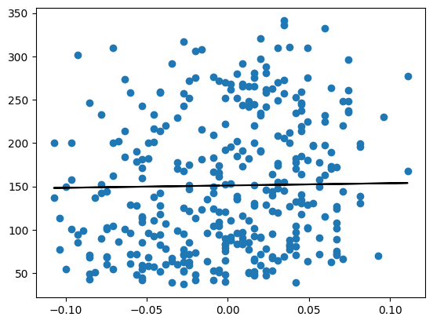
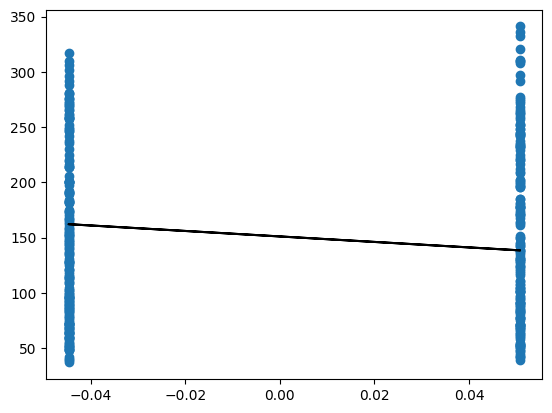
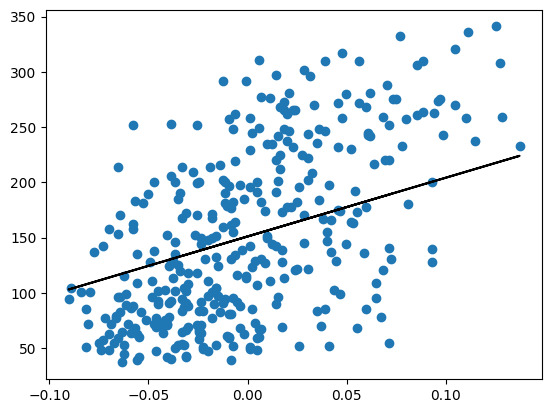
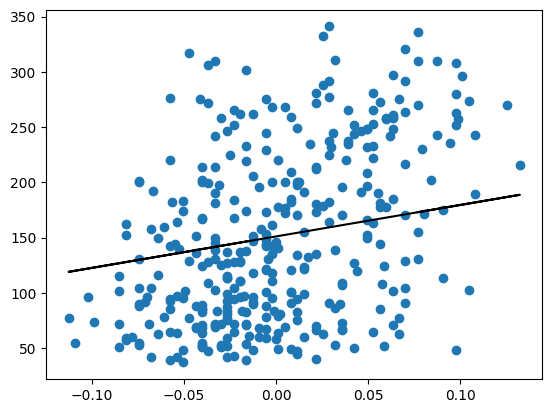
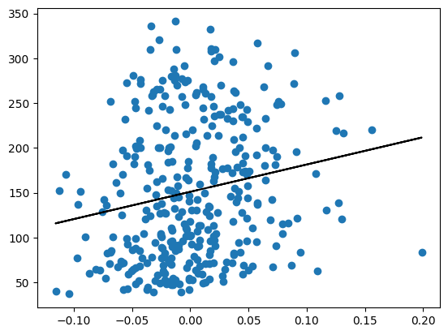
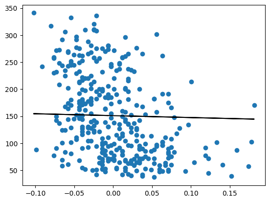
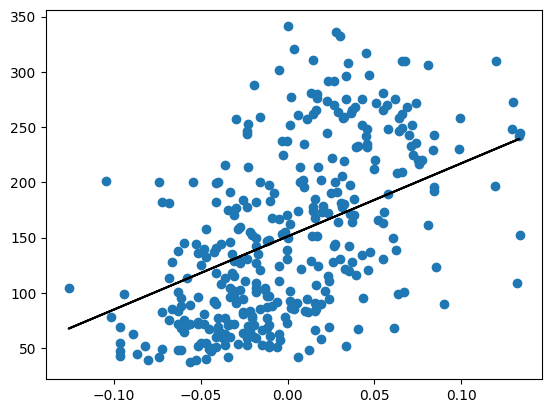
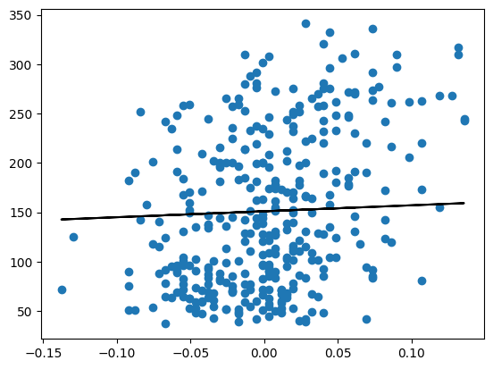
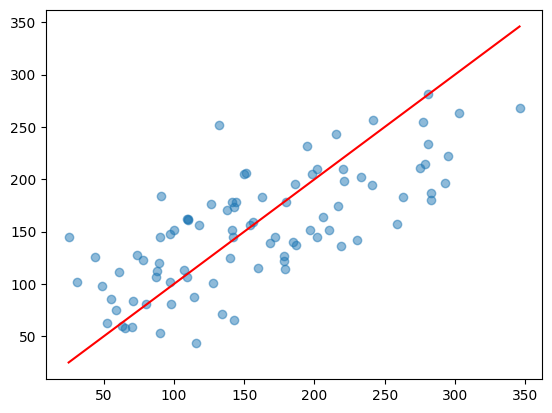

# Implementation of Linear Regression

## Importing Libraries


```python
import numpy as np
import pandas as pd
from sklearn.datasets import load_diabetes
import matplotlib.pyplot as plt
%matplotlib inline
```

## Loading Data


```python
diabetes = load_diabetes()
dat = np.hstack((diabetes.data, diabetes.target.reshape(-1,1)))
np.random.shuffle(dat)
x = dat[:,:-1]
y = dat[:,-1]
```

## Test-Train Splitting


```python
l_train = 353
l_test = 89

train_x, train_y = x[0:l_train,:], y[0:l_train]
test_x, test_y = x[l_train:,:], y[l_train:]

train_x = np.hstack((np.ones((l_train,1)), train_x))
test_x = np.hstack((np.ones((l_test,1)), test_x))
```

## Setting Parameters


```python
parameters = x.shape[1]
theta = np.zeros(parameters+1)
threshold = 1e-6
alpha = 0.01
```

## Training Using Batch Gradient Descent


```python
prevcost = float('inf')
while True:
    hypothesis = train_x @ theta
    
    theta = theta + (alpha/l_train)*(train_x.T @ (train_y-hypothesis))
    currcost = (1/(2*l_train))*np.sum(np.square(train_y-hypothesis))
    
    if abs(currcost-prevcost) <= threshold:
        break

    prevcost = currcost
```


```python
for i in range(1,parameters+1):
    plt.figure()
    plt.scatter(train_x[:,i], train_y, label=f'Feature {i}')

    prediction = theta[0] + theta[i]*train_x[:,i]
    plt.plot(train_x[:,i], prediction, color="black", label=f'Line for theta[{i+1}]')
```


    

    


    

    


    

    


    

    


    

    


    

    


    

    


    

    


    

    


    

    


## Testing


```python
test_predictions = test_x @ theta
```


```python
MSE = (1/l_test)*(np.sum(np.square(test_y-test_predictions)))
MSE
```


    np.float64(2621.4403012594803)


```python
MAE = (1/l_test)*(np.sum(np.abs(test_y-test_predictions)))
MAE
```


    np.float64(42.11016539512633)


```python
y_mean = np.mean(test_y)
ss_total = np.sum((test_y-y_mean)**2)
ss_residual = np.sum((test_y-test_predictions)**2)
R2 = 1-(ss_residual/ss_total)
R2
```


    np.float64(0.530874744509449)


```python
plt.scatter(test_y, test_predictions, alpha=0.5)
plt.plot([min(test_y), max(test_y)], [min(test_y), max(test_y)], color="red")
```


    [<matplotlib.lines.Line2D at 0x7595f150c800>]


    

    

