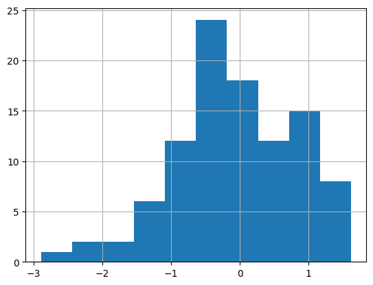
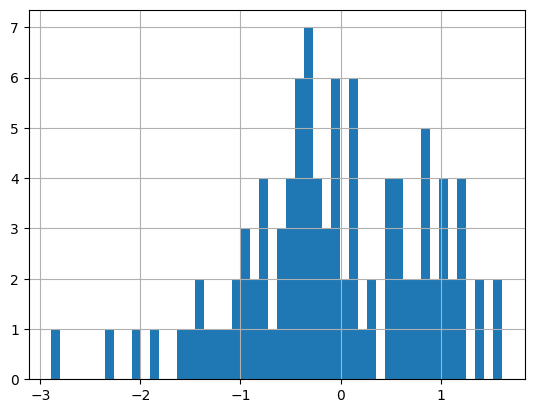
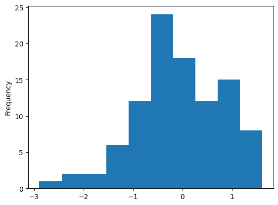
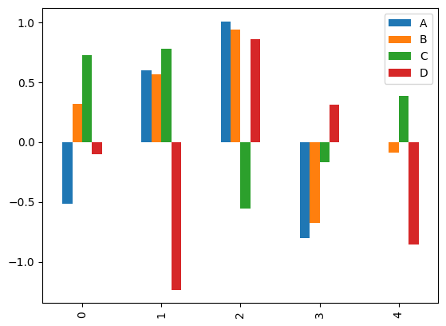
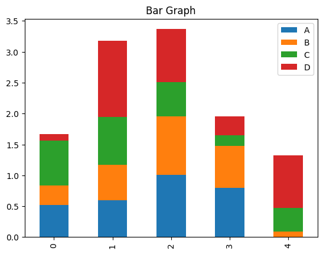
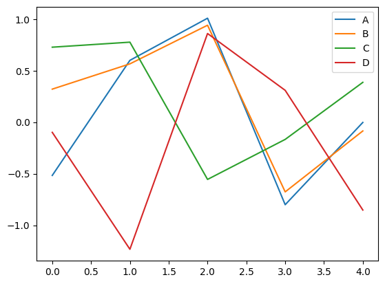
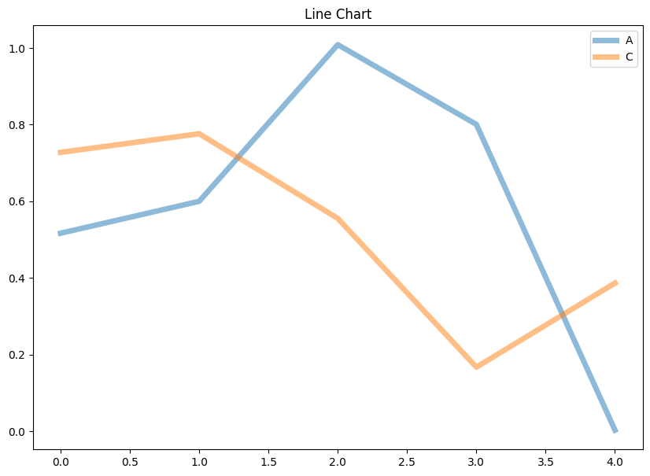
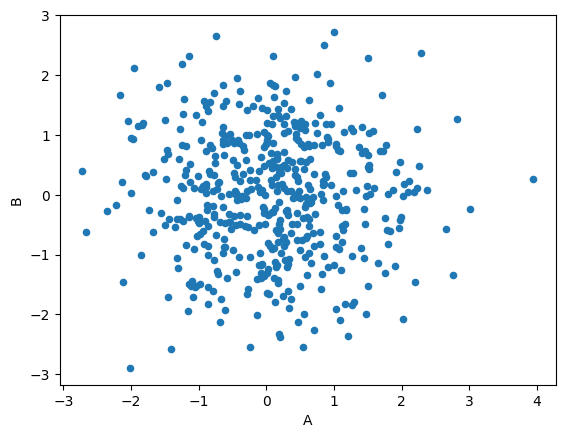
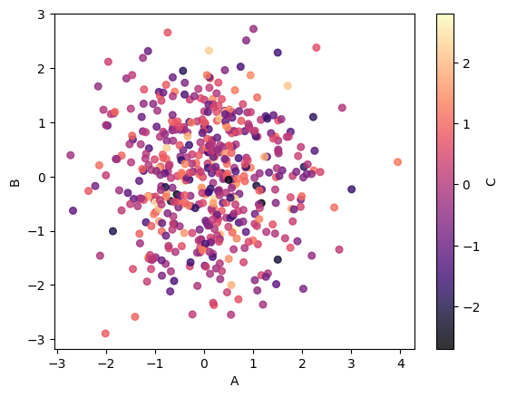
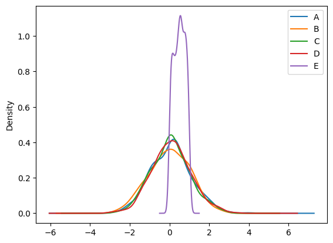

# MatPlotLib
Matplotlib is a popular Python library for data visualization. It is widely used for plotting and creating graphs in 2D and 3D, offering great flexibility for customization. Matplotlib allows users to create plots, histograms, bar charts, scatterplots, etc. making it essential for data analysis.

The matplotlib library needs to be installed through pip, after which it can be imported to a Python Project

```python
import pandas as pd
import numpy as np
%matplotlib inline
```

### Histogram


```python
df = pd.DataFrame(np.random.randn(100,4), columns = ['A','B','C','D'])
df
```


<div>
<style scoped>
    .dataframe tbody tr th:only-of-type {
        vertical-align: middle;
    }

    .dataframe tbody tr th {
        vertical-align: top;
    }

    .dataframe thead th {
        text-align: right;
    }
</style>
<table border="1" class="dataframe">
  <thead>
    <tr style="text-align: right;">
      <th></th>
      <th>A</th>
      <th>B</th>
      <th>C</th>
      <th>D</th>
    </tr>
  </thead>
  <tbody>
    <tr>
      <th>0</th>
      <td>-1.183565</td>
      <td>-0.843250</td>
      <td>-1.377454</td>
      <td>-0.164975</td>
    </tr>
    <tr>
      <th>1</th>
      <td>0.258768</td>
      <td>1.189341</td>
      <td>0.622342</td>
      <td>-0.913438</td>
    </tr>
    <tr>
      <th>2</th>
      <td>-0.298482</td>
      <td>-0.055930</td>
      <td>-1.735907</td>
      <td>-1.294685</td>
    </tr>
    <tr>
      <th>3</th>
      <td>0.152852</td>
      <td>0.677888</td>
      <td>1.785053</td>
      <td>-0.017386</td>
    </tr>
    <tr>
      <th>4</th>
      <td>0.453490</td>
      <td>-0.759681</td>
      <td>0.014492</td>
      <td>-1.327603</td>
    </tr>
    <tr>
      <th>...</th>
      <td>...</td>
      <td>...</td>
      <td>...</td>
      <td>...</td>
    </tr>
    <tr>
      <th>95</th>
      <td>1.447038</td>
      <td>-1.050747</td>
      <td>-0.001146</td>
      <td>-0.663410</td>
    </tr>
    <tr>
      <th>96</th>
      <td>0.574527</td>
      <td>1.186044</td>
      <td>-0.143849</td>
      <td>0.450171</td>
    </tr>
    <tr>
      <th>97</th>
      <td>1.067423</td>
      <td>-0.168291</td>
      <td>-2.165902</td>
      <td>-0.638288</td>
    </tr>
    <tr>
      <th>98</th>
      <td>-1.143882</td>
      <td>-0.377700</td>
      <td>2.008156</td>
      <td>0.250141</td>
    </tr>
    <tr>
      <th>99</th>
      <td>1.652625</td>
      <td>-1.137616</td>
      <td>0.199954</td>
      <td>0.346154</td>
    </tr>
  </tbody>
</table>
<p>100 rows × 4 columns</p>
</div>


```python
df['B'].hist()
```


    <Axes: >


    

    


```python
df['B'].hist(bins=50)
```


    <Axes: >


    

    


```python
#Alternate Method
df['B'].plot(kind="hist")
```


    <Axes: ylabel='Frequency'>


    

    


### Bar Graph


```python
df1 = pd.DataFrame(np.random.randn(5,4), columns=["A","B","C","D"])
df1
```


<div>
<style scoped>
    .dataframe tbody tr th:only-of-type {
        vertical-align: middle;
    }

    .dataframe tbody tr th {
        vertical-align: top;
    }

    .dataframe thead th {
        text-align: right;
    }
</style>
<table border="1" class="dataframe">
  <thead>
    <tr style="text-align: right;">
      <th></th>
      <th>A</th>
      <th>B</th>
      <th>C</th>
      <th>D</th>
    </tr>
  </thead>
  <tbody>
    <tr>
      <th>0</th>
      <td>-0.516680</td>
      <td>0.320694</td>
      <td>0.727671</td>
      <td>-0.098804</td>
    </tr>
    <tr>
      <th>1</th>
      <td>0.599938</td>
      <td>0.565920</td>
      <td>0.776355</td>
      <td>-1.233074</td>
    </tr>
    <tr>
      <th>2</th>
      <td>1.008831</td>
      <td>0.940639</td>
      <td>-0.555375</td>
      <td>0.860355</td>
    </tr>
    <tr>
      <th>3</th>
      <td>-0.800722</td>
      <td>-0.676299</td>
      <td>-0.167141</td>
      <td>0.308990</td>
    </tr>
    <tr>
      <th>4</th>
      <td>-0.002615</td>
      <td>-0.085067</td>
      <td>0.386567</td>
      <td>-0.852523</td>
    </tr>
  </tbody>
</table>
</div>


```python
df1.plot(kind="bar")
```


    <Axes: >


    

    


```python
df1.abs().plot(kind="bar", stacked=True, title="Bar Graph", legend=True)
```


    <Axes: title={'center': 'Bar Graph'}>


    

    


### Line Graph


```python
df1.plot(kind="line")
```


    <Axes: >


    

    


```python
df1[['A','C']].abs().plot(kind="line",lw=5, figsize=(10,7), alpha = 0.5, title='Line Chart')
```


    <Axes: title={'center': 'Line Chart'}>


    

    


### Scatter Plot


```python
newdf = pd.DataFrame(np.random.randn(400,4),columns=["A","B","C","D"])
df = pd.concat([df,newdf],ignore_index=True)
df
```


<div>
<style scoped>
    .dataframe tbody tr th:only-of-type {
        vertical-align: middle;
    }

    .dataframe tbody tr th {
        vertical-align: top;
    }

    .dataframe thead th {
        text-align: right;
    }
</style>
<table border="1" class="dataframe">
  <thead>
    <tr style="text-align: right;">
      <th></th>
      <th>A</th>
      <th>B</th>
      <th>C</th>
      <th>D</th>
    </tr>
  </thead>
  <tbody>
    <tr>
      <th>0</th>
      <td>-1.183565</td>
      <td>-0.843250</td>
      <td>-1.377454</td>
      <td>-0.164975</td>
    </tr>
    <tr>
      <th>1</th>
      <td>0.258768</td>
      <td>1.189341</td>
      <td>0.622342</td>
      <td>-0.913438</td>
    </tr>
    <tr>
      <th>2</th>
      <td>-0.298482</td>
      <td>-0.055930</td>
      <td>-1.735907</td>
      <td>-1.294685</td>
    </tr>
    <tr>
      <th>3</th>
      <td>0.152852</td>
      <td>0.677888</td>
      <td>1.785053</td>
      <td>-0.017386</td>
    </tr>
    <tr>
      <th>4</th>
      <td>0.453490</td>
      <td>-0.759681</td>
      <td>0.014492</td>
      <td>-1.327603</td>
    </tr>
    <tr>
      <th>...</th>
      <td>...</td>
      <td>...</td>
      <td>...</td>
      <td>...</td>
    </tr>
    <tr>
      <th>495</th>
      <td>0.603440</td>
      <td>-1.341759</td>
      <td>-0.038399</td>
      <td>-0.041227</td>
    </tr>
    <tr>
      <th>496</th>
      <td>-0.033351</td>
      <td>0.802556</td>
      <td>-1.044675</td>
      <td>-1.587895</td>
    </tr>
    <tr>
      <th>497</th>
      <td>-0.243808</td>
      <td>0.407394</td>
      <td>0.295858</td>
      <td>-0.759214</td>
    </tr>
    <tr>
      <th>498</th>
      <td>1.007258</td>
      <td>2.720650</td>
      <td>-0.308004</td>
      <td>0.584934</td>
    </tr>
    <tr>
      <th>499</th>
      <td>0.639343</td>
      <td>-0.516006</td>
      <td>0.240183</td>
      <td>0.840244</td>
    </tr>
  </tbody>
</table>
<p>500 rows × 4 columns</p>
</div>


```python
df.plot(kind="scatter",x="A",y="B")
```


    <Axes: xlabel='A', ylabel='B'>


    

    


```python
df.plot(kind="scatter", x="A", y="B", c='C', cmap='magma',s=30,alpha=0.8)
```


    <Axes: xlabel='A', ylabel='B'>


    

    


### Kernel Density Estimation (KDE) Plot


```python
df["E"] = np.random.rand(500)
df
```


<div>
<style scoped>
    .dataframe tbody tr th:only-of-type {
        vertical-align: middle;
    }

    .dataframe tbody tr th {
        vertical-align: top;
    }

    .dataframe thead th {
        text-align: right;
    }
</style>
<table border="1" class="dataframe">
  <thead>
    <tr style="text-align: right;">
      <th></th>
      <th>A</th>
      <th>B</th>
      <th>C</th>
      <th>D</th>
      <th>E</th>
    </tr>
  </thead>
  <tbody>
    <tr>
      <th>0</th>
      <td>-1.183565</td>
      <td>-0.843250</td>
      <td>-1.377454</td>
      <td>-0.164975</td>
      <td>0.909111</td>
    </tr>
    <tr>
      <th>1</th>
      <td>0.258768</td>
      <td>1.189341</td>
      <td>0.622342</td>
      <td>-0.913438</td>
      <td>0.084766</td>
    </tr>
    <tr>
      <th>2</th>
      <td>-0.298482</td>
      <td>-0.055930</td>
      <td>-1.735907</td>
      <td>-1.294685</td>
      <td>0.959977</td>
    </tr>
    <tr>
      <th>3</th>
      <td>0.152852</td>
      <td>0.677888</td>
      <td>1.785053</td>
      <td>-0.017386</td>
      <td>0.170842</td>
    </tr>
    <tr>
      <th>4</th>
      <td>0.453490</td>
      <td>-0.759681</td>
      <td>0.014492</td>
      <td>-1.327603</td>
      <td>0.753286</td>
    </tr>
    <tr>
      <th>...</th>
      <td>...</td>
      <td>...</td>
      <td>...</td>
      <td>...</td>
      <td>...</td>
    </tr>
    <tr>
      <th>495</th>
      <td>0.603440</td>
      <td>-1.341759</td>
      <td>-0.038399</td>
      <td>-0.041227</td>
      <td>0.221247</td>
    </tr>
    <tr>
      <th>496</th>
      <td>-0.033351</td>
      <td>0.802556</td>
      <td>-1.044675</td>
      <td>-1.587895</td>
      <td>0.417872</td>
    </tr>
    <tr>
      <th>497</th>
      <td>-0.243808</td>
      <td>0.407394</td>
      <td>0.295858</td>
      <td>-0.759214</td>
      <td>0.738754</td>
    </tr>
    <tr>
      <th>498</th>
      <td>1.007258</td>
      <td>2.720650</td>
      <td>-0.308004</td>
      <td>0.584934</td>
      <td>0.362388</td>
    </tr>
    <tr>
      <th>499</th>
      <td>0.639343</td>
      <td>-0.516006</td>
      <td>0.240183</td>
      <td>0.840244</td>
      <td>0.630808</td>
    </tr>
  </tbody>
</table>
<p>500 rows × 5 columns</p>
</div>


```python
df.plot(kind="kde")
```


    <Axes: ylabel='Density'>


    

